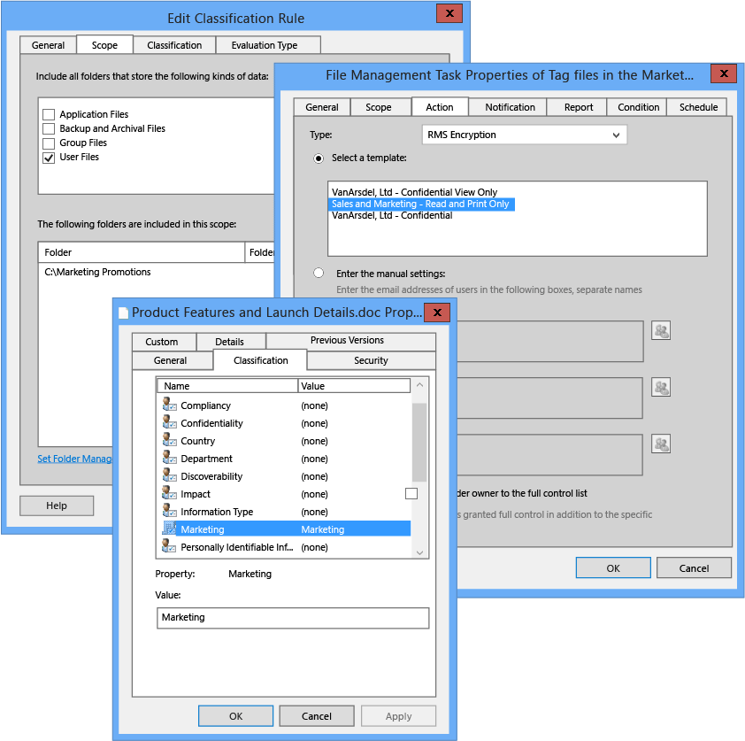

# Billede i fuld sk&#230;rm: Konfiguration af FCI for Marketing klassificering

Tilbage til [Azure RMS i aktion: Automatisk beskytte filer på filservere, der kører Windows Server og fil klassificering infrastruktur](http://technet.microsoft.com/library/jj585026.aspx).

