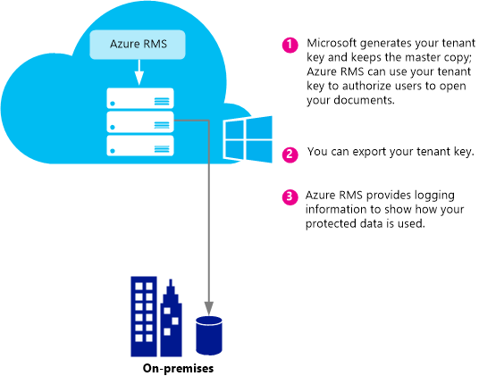
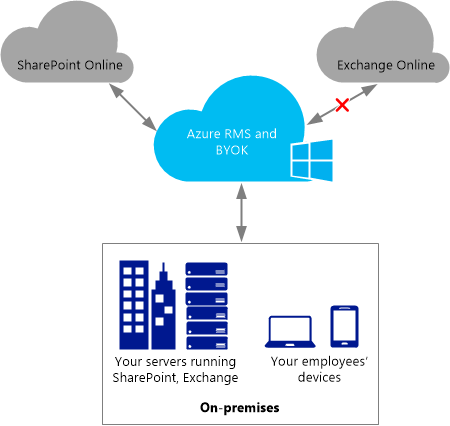

# Planl&#230;gning og implementering af Azure Rights Management lejer n&#248;glen
Du kan bruge oplysningerne i dette emne kan hjælpe dig med at planlægge og styre din Rights Management-tjenesten (RMS) lejer nøgle for Azure RMS. For eksempel, i stedet for Microsoft administrerer din lejer nøgle (standard), kan du administrere dine egne lejer nøgle for at overholde bestemte regler, der gælder for din organisation.  Administration af din egen lejer nøgle kaldes også for at få din egen nøgle eller BYOK, som.

> [!NOTE]
> RMS lejer nøgle kaldes også nøglen Server Licensgiver certifikat (SLC). Azure RMS vedligeholder en eller flere nøgler for hver organisation, der abonnerer på Azure RMS. Når en nøgle, der bruges til RMS i en organisation (såsom brugernøgler, computer nøgler, dokument krypteringsnøgler), sammenkæder de kryptografisk RMS lejer nøglen.

**Overblik:** Brug tabellen nedenfor som en hurtig vejledning til den anbefalede lejer nøgle topologi. Derefter kan bruge flere sektioner for at få yderligere oplysninger.

Hvis du installerer Azure RMS ved hjælp af en nøgle til lejer, der administreres af Microsoft, kan du ændre til BYOK senere. Du kan dog ændre Azure RMS lejer nøglen i øjeblikket fra BYOK, der administreres af Microsoft.

|Forretningsbehov|Anbefalede lejer nøgle topologi|
|--------------------|-----------------------------------|
|Installer Azure RMS, hurtigt og uden at kræve særlig hardware|Administreres af Microsoft|
|Har du brug for fuld IRM-funktionaliteten i Exchange Online med Azure RMS|Administreres af Microsoft|
|Nøglerne er oprettet af dig og beskyttet i en hardware security module (HSM)|BYOK<br /><br />I øjeblikket er vil denne konfiguration resultere i reducerede IRM-funktioner i Exchange Online. Yderligere oplysninger finder du i [BYOK pricing and restrictions](../Topic/Planning_and_Implementing_Your_Azure_Rights_Management_Tenant_Key.md#BKMK_Pricing) afsnit.|
Brug de følgende afsnit kan du vælge, hvilken tast lejer topologi til at bruge, forstå lejer nøgle livscyklus, hvordan du implementerer sætter din egen nøgle (BYOK), og hvilke skridt du skal tage næste:

-   [Choose your tenant key topology: Managed by Microsoft (the default) or managed by you (BYOK)](../Topic/Planning_and_Implementing_Your_Azure_Rights_Management_Tenant_Key.md#BKMK_ChooseTenantKey)

-   [BYOK pricing and restrictions](../Topic/Planning_and_Implementing_Your_Azure_Rights_Management_Tenant_Key.md#BKMK_Pricing)

-   [Implementing bring your own key (BYOK)](../Topic/Planning_and_Implementing_Your_Azure_Rights_Management_Tenant_Key.md#BKMK_ImplementBYOK)

-   [Next steps](../Topic/Planning_and_Implementing_Your_Azure_Rights_Management_Tenant_Key.md#BKMK_NextSteps)

## <a name="BKMK_ChooseTenantKey"></a>Vælg din lejer nøgle topologi: Administreres af Microsoft (standard) eller administreret af dig (BYOK)
Beslutte, hvilke lejer nøgle topologi er bedst for din organisation. Som standard Azure RMS genererer lejer nøglen og administrerer de fleste aspekter af lejer nøgle livscyklus. Dette er den nemmeste indstilling med laveste administrative udgifter. I de fleste tilfælde behøver du selv ikke at vide, at du har en nøgle til lejeradministration. Du tilmelde blot dig Azure RMS og resten af processen nøgleadministration håndteres af Microsoft.

Alternativt kan du fuld kontrol over din lejer nøgle, som omfatter oprettelse af lejer-tasten og holde hovedkopien af dine lokaler. Dette scenario er ofte benævnt som sætter din egen nøgle (BYOK). Med denne indstilling sker følgende:

1.  Du kan generere lejer nøglen på din virksomhed, i overensstemmelse med din IT-politikker.

2.  Du overføre sikkert nøglen lejer fra en Hardware Security Module (HSM) i din besiddelse til HSMs, som ejes og administreres af Microsoft. I hele denne proces efterlader din lejer nøgle aldrig grænsen for beskyttelse af hardware.

3.  Når du overfører din lejer nøgle til Microsoft, bliver den beskyttet af Thales HSMs. Microsoft har samarbejdet med Thales til at sikre, at din lejer nøgle ikke kan udledes fra Microsofts HSMs.

Men det er valgfrit, du vil også sandsynligvis vil bruge næsten realtid forbruget logs fra Azure RMS at se præcist hvordan og hvornår din nøgle til lejeradministration bruges.

> [!NOTE]
> Som en ekstra beskyttelse foranstaltning bruger Azure RMS verdener separat sikkerhed for sine datacentre i Nordamerika, EMEA (Europa, Mellemøsten og Afrika) og Asien. Når du administrerer din egen nøgle lejer, er den knyttet til verden sikkerhed for det område, hvor din RMS-lejeradministration er registreret. For eksempel kan en lejer nøgle fra en kunde, Europa ikke bruges i datacentre i Nordamerika eller Asien.

## <a name="BKMK_OverviewLifecycle"></a>Lejer nøgle livscyklus
Hvis du beslutter, at Microsoft skal administrere lejer nøglen, håndterer Microsoft de fleste af de vigtigste livscyklus operationer. Men hvis du beslutter at administrere din lejer nøgle, du er ansvarlig for mange af de vigtigste livscyklus handlinger og nogle ekstra procedurer.

Følgende diagrammer viser og sammenligner disse to indstillinger. Det første diagram viser, hvor lidt der er du i standardkonfigurationen når administrerer Microsoft nøglen lejer administrator indirekte omkostninger.



Det andet diagram viser de ekstra trin, der kræves, når du administrerer din egen nøgle til lejeradministration.


Hvis du beslutter at lade Microsoft administrerer din lejer nøgle, ingen yderligere handling er påkrævet for at generere nøglen, og du kan springe følgende afsnit over og gå direkte til [Next steps](../Topic/Planning_and_Implementing_Your_Azure_Rights_Management_Tenant_Key.md#BKMK_NextSteps).

Hvis du beslutter at administrere din nøgle til lejer selv, kan du læse de følgende afsnit for at få yderligere oplysninger.

### Yderligere oplysninger om Thales HSMs og Microsoft-tilføjelser
Azure RMS bruger Thales HSMs til at beskytte dine nøgler.

Thales e-sikkerhed er en førende global udbyder af datakryptering og cyber security-løsningerne til de finansielle tjenesteydelser, højteknologiske, produktion, regering og it-sektoren. Med en 40 års dokumenteret beskyttelse af virksomheder og offentlige oplysninger, Thales løsninger, der bruges af fire af de fem største energi og aerospace virksomheder 22 NATO 's lande, og sikre mere end 80 procent af verden over betalingstransaktioner.

Microsoft har partnerbutikker Thales til at forbedre tilstanden for art for HSMs. Disse forbedringer gør det muligt at få typiske fordelene ved tjenester uden at opgive kontrol over dine nøgler. Disse forbedringer kan især Microsoft administrerer HSMs, så du ikke behøver at. Som en cloud-tjeneste skalerer Azure RMS med kort varsel at opfylde din organisations brug spidser. Din nøgle er beskyttet i Microsofts HSMs på samme tid: Du kan bevare kontrollen over nøgle livscyklus, fordi du oprette nøglen og overføre det til Microsofts HSMs.

Yderligere oplysninger finder du i [HSMs Thales og Azure RMS](http://www.thales-esecurity.com/msrms/cloud) på webstedet til Thales.

## <a name="BKMK_Pricing"></a>BYOK priser og begrænsninger
Organisation, der har et IT-styret Azure abonnement kan bruge BYOK og log brugen uden merpris. Organisationer, der bruger RMS for personer kan ikke bruge BYOK og logføring, fordi de ikke har en lejeadministratoren til at konfigurere disse funktioner.

> [!NOTE]
> Finde flere oplysninger om RMS for personer, [RMS for enkeltpersoner og Azure rettighedsstyring](../Topic/RMS_for_Individuals_and_Azure_Rights_Management.md).



Arbejde problemfrit sammen med hvert eneste program, der integrerer med Azure RMS, BYOK og logføring. Dette inkluderer sky tjenester som SharePoint Online, lokale servere, der kører Exchange og SharePoint, som arbejder med Azure RMS ved hjælp af RMS-stik og klientprogrammer såsom Office 2013. Du får nøgleanvendelse logfiler, uanset hvilket program gør anmodninger af Azure RMS.

Der er én undtagelse: I øjeblikket er **Azure RMS-BYOK er ikke kompatibel med Exchange Online**.  Hvis du vil bruge Exchange Online, anbefaler vi, at du implementerer Azure RMS i nøgleadministration standardtilstanden nu, hvor Microsoft opretter og administrerer din nøgle. Du har mulighed for at flytte til BYOK senere, for eksempel når Exchange Online understøtter Azure RMS BYOK. Men hvis du ikke kan vente, en anden mulighed er at anvende Azure RMS med BYOK nu, med reducerede RMS-funktioner i Exchange Online (ubeskyttet emails og ubeskyttede vedhæftede filer forbliver fuldt funktionsdygtig):

-   E-mails, beskyttede eller beskyttede vedhæftede filer i Outlook Web Access kan ikke vises.

-   Beskyttede e-mails på mobile enheder, der bruger Exchange ActiveSync IRM kan ikke vises.

-   Transport dekryptering (for eksempel til at scanne for malware) og journal dekryptering er ikke mulig, således beskyttede e-mails og vedhæftede filer beskyttet springes over.

-   Transport beskyttelse regler og data tab forebyggelse (DLP), der gennemtvinger IRM-politikker er ikke muligt, så RMS beskyttelse ikke kan anvendes ved hjælp af disse metoder.

-   Server-baseret søgning efter beskyttede e-mails, så vil blive sprunget over beskyttede e-mails.

Når du bruger Azure RMS BYOK med reducerede RMS-funktioner i Exchange Online, fungerer RMS med e-mail-klienter i Outlook på Windows og Mac og i andre e-mail-klienter, der ikke anvender Exchange ActiveSync IRM.

Hvis du vil overføre til Azure RMS fra AD RMS, måske er importeret din nøgle som en publicerer tillidsdomænet (TPD) til Exchange Online (også kaldet BYOK i Exchange-terminologi, der er adskilt fra Azure RMS BYOK). I dette scenario, skal du fjerne TPD fra Exchange Online for at undgå modstridende politikker og skabeloner. Yderligere oplysninger finder du i [Fjern RMSTrustedPublishingDomain](https://technet.microsoft.com/library/jj200720%28v=exchg.150%29.aspx) fra biblioteket Exchange Online-cmdlet'er.

Nogle gange er Azure RMS BYOK undtagelsen for Exchange Online ikke et problem i praksis. Organisationer, der har brug for BYOK og -logføring køres eksempelvis deres data programmer (Exchange, SharePoint, Office) på stedet, og brug Azure RMS til funktioner, ikke der er let tilgængelige med lokale AD RMS (for eksempel samarbejde med andre virksomheder og adgang fra mobile klienter). Både BYOK og logføring arbejde samt i denne situation og gøre det muligt for organisationen at have fuld kontrol over deres Azure RMS-abonnement.

## <a name="BKMK_ImplementBYOK"></a>Implementering af sætter din egen nøgle (BYOK)
Brug de oplysninger og procedurer i dette afsnit, hvis du har besluttet at oprette og administrere din lejer nøgle; Medbring din egen nøgle (BYOK) scenario:

-   [Prerequisites for BYOK](../Topic/Planning_and_Implementing_Your_Azure_Rights_Management_Tenant_Key.md#BKMK_Preqs)

-   [Generate and transfer your tenant key – over the Internet](../Topic/Planning_and_Implementing_Your_Azure_Rights_Management_Tenant_Key.md#BKMK_BYOK_Internet)

-   [Generate and transfer your tenant key – in person](../Topic/Planning_and_Implementing_Your_Azure_Rights_Management_Tenant_Key.md#BKMK_BYOK_InPerson)

> [!IMPORTANT]
> Hvis du allerede har startet at bruge [!INCLUDE[aad_rightsmanagement_1](../Token/aad_rightsmanagement_1_md.md)] (tjenesten er aktiveret), og du har brugere, der kører Office 2010, skal du kontakte Microsoft Customer Support Services (CSS), før du kører disse procedurer. Afhængigt af din situation og krav, kan du stadig bruge BYOK, men med visse begrænsninger eller ekstra trin.
> 
> Kontakt også CSS, hvis din organisation har bestemte politikker til håndtering af nøgler.

### <a name="BKMK_Preqs"></a>Forudsætninger for BYOK
Se nedenstående tabel for en liste over forudsætningerne for at medbringe din egen nøgle (BYOK).

|Kravet om|Yderligere oplysninger|
|-------------|--------------------------|
|Et abonnement, der understøtter Azure RMS|Finde flere oplysninger om, hvilke abonnementer der er tilgængelige i [Sky-abonnementer, der understøtter Azure RMS](../Topic/Requirements_for_Azure_Rights_Management.md#BKMK_SupportedSubscriptions) afsnit i den [Krav til Azure rettighedsstyring](../Topic/Requirements_for_Azure_Rights_Management.md) emne.|
|Du bruger ikke RMS for enkelte brugere eller Exchange Online. Eller hvis du bruger Exchange Online, skal du forstå og acceptere begrænsninger ved brug af BYOK med denne konfiguration.|Finde flere oplysninger om begrænsninger og begrænsninger for BYOK, den [BYOK pricing and restrictions](../Topic/Planning_and_Implementing_Your_Azure_Rights_Management_Tenant_Key.md#BKMK_Pricing) afsnit i dette emne. **Important:** BYOK er i øjeblikket ikke kompatibel med Exchange Online.|
|Thales HSM, chipkort og supportsoftware<br /><br />Hvis du overfører fra AD RMS på Azure RMS ved hjælp af softwarenøgle til hardwarenøgle, skal du have en minimal version af 11.62 for Thales-drivere.|Du skal have adgang til et Thales Hardware Sikkerhedsmodulet og grundlæggende operationelle kendskab til Thales HSMs. Se [Thales Hardware Sikkerhedsmodulet](http://www.thales-esecurity.com/msrms/buy) til listen over kompatible modeller eller købe en HSM, hvis du ikke har en.|
|Hvis du vil overføre din lejer nøgle via internettet i stedet for at være fysisk til stede i Odense, Danmark:<br /><br />1.  En offline 64 x arbejdsstation med et minimum Windows-operativsystemet Windows 7 og Thales nShield software, der er mindst version 11.62.<br />    Hvis arbejdsstationen kører Windows 7, skal du [installere Microsoft,.NET Framework 4.5](http://go.microsoft.com/fwlink/?LinkId=225702).<br />2.  En arbejdsstation, der er forbundet til internettet og har en minimum Windows-operativsystemet i Windows 7.<br />3.  Et USB-drev eller anden bærbar lagringsenhed, der har mindst 16 MB ledig plads.|Disse forudsætninger er ikke påkrævet, hvis du rejser til Redmond og overføre din lejer nøgle i person.<br /><br />Af sikkerhedsmæssige årsager anbefaler vi, at den første arbejdsstation ikke er tilsluttet et netværk. Men dette ved hjælp af programmering gennemtvinges ikke. **Note:** I vejledningen, der følger omtales denne arbejdsstation som den afbrudte arbejdsstation.<br />Hvis din lejer nøgle bruges til en produktion netværket, anbefaler vi desuden, at du bruger en anden, separat arbejdsstation at hente værktøjssæt og overføre nøglen til lejeradministration. Men du kan bruge den samme arbejdsstation til testformål, som det første. **Note:** I vejledningen, der følger, henvises der til denne anden arbejdsstation som den Internet-opkoblet arbejdsstation.|
|Valgfrit: Azure-abonnement|Hvis du vil logge din lejer nøgleanvendelse (og brugen af Rights Management), skal du have et abonnement på Azure og tilstrækkelig lagerplads på Azure til at gemme dine logfiler.|
Procedurer til at oprette og bruge din egen lejer nøgle afhænger af, om du vil gøre dette via internettet eller personligt:

-   **Via internettet:** Dette kræver ekstra konfigurationstrin, som henter og ved hjælp af et værktøjssæt og Windows PowerShell-cmdletter. Du har dog ikke at være fysisk i en Microsoft-funktion til at overføre din lejer nøgle. Sikkerheden opretholdes ved hjælp af følgende metoder:

    -   Du kan generere nøglen lejer fra en arbejdsstation, hvilket reducerer angrebsoverfladen offline.

    -   Lejer-nøgle er krypteret med en nøgle Exchange nøgle (KEK), som forbliver krypterede, indtil de overføres til Azure RMS-HSMs. Den krypterede version af din lejer nøgle bevarer den oprindelige arbejdsstation.

    -   Et værktøj, der angiver egenskaber på din lejer nøgle, som binder lejer nøglen til Azure RMS sikkerhed verden. Så når Azure RMS HSMs modtager og dekryptere din lejer nøgle, kan kun disse HSMs bruge den. Lejer nøglen kan ikke eksporteres. Bindingen er gennemtvunget af Thales-HSMs.

    -   De Key Exchange nøgle (KEK), der bruges til at kryptere din lejer nøgle genereres i Azure RMS-HSMs og kan ikke eksporteres. HSMs gennemtvinge, at der kan være nogen klar version af KEK uden for HSMs. Derudover omfatter værktøjssæt attestation fra Thales, at KEK kan ikke eksporteres, og blev oprettet i en ægte HSM, som blev produceret af Thales.

    -   Værktøjssæt, der omfatter en attest fra Thales, Azure RMS sikkerhed verden også blev oprettet på en ægte HSM produceret af Thales. Det viser sig, at du, at Microsoft bruger ægte hardware.

    -   Microsoft bruger separate KEKs samt separate sikkerhed verdener i hvert geografisk område, som sikrer, at din lejer nøgle kan bruges kun i datacentre i det område, hvori du krypteret det. For eksempel kan en lejer nøgle fra en kunde, Europa ikke bruges i datacentre i Nordamerika eller Asien.

    > [!NOTE]
    > Lejer-tasten kan sikkert flytte gennem ikke har tillid til computere og netværk, fordi den er krypteret og sikret med niveau rettigheder for adgangskontrol, der gør systemet brugbart kun inden for din HSMs og Microsofts HSMs for Azure RMS. Du kan bruge scripts, der findes i værktøjssæt til at kontrollere Sikringsforanstaltningerne og læse flere oplysninger om, hvordan det fungerer fra Thales: [Hardware Key management i skyen RMS](https://www.thales-esecurity.com/knowledge-base/white-papers/hardware-key-management-in-the-rms-cloud).

-   **Personligt:** Dette kræver, at du kontakter Microsoft Customer Support Services (CSS) for at planlægge en aftale for overførsel til Azure RMS. Du skal rejse til et Microsoft office i Redmond, Washington, USA til at overføre din lejer nøgle til Azure RMS sikkerhed verden.

### <a name="BKMK_BYOK_Internet"></a>Generere og overføre din lejer nøgle – via internettet
Benyt følgende fremgangsmåde, hvis du vil overføre din lejer nøgle via internettet i stedet for at rejse til en Microsoft-facilitet til at overføre nøglen lejer i person:

-   [Prepare your Internet-connected workstation](../Topic/Planning_and_Implementing_Your_Azure_Rights_Management_Tenant_Key.md#BKMK_InternetPrepareWorkstation)

-   [Prepare your disconnected workstation](../Topic/Planning_and_Implementing_Your_Azure_Rights_Management_Tenant_Key.md#BKMK_DisconnectedPrepareWorkstation)

-   [Generate your tenant key](../Topic/Planning_and_Implementing_Your_Azure_Rights_Management_Tenant_Key.md#BKMK_InternetGenerate)

-   [Prepare your tenant key for transfer](../Topic/Planning_and_Implementing_Your_Azure_Rights_Management_Tenant_Key.md#BKMK_InternetPrepareTransfer)

-   [Transfer your tenant key to Azure RMS](../Topic/Planning_and_Implementing_Your_Azure_Rights_Management_Tenant_Key.md#BKMK_InternetTransfer)

#### <a name="BKMK_InternetPrepareWorkstation"></a>Forbered din Internet-opkoblet arbejdsstation.
For at forberede din arbejdsstation, der er forbundet til internettet, skal du følge disse 3 trin:

-   [Step 1: Install Windows PowerShell for Azure Rights Management](../Topic/Planning_and_Implementing_Your_Azure_Rights_Management_Tenant_Key.md#BKMK_PrepareInternetConnectedWorkstation1)

-   [Step 2: Get your Azure Active Directory tenant ID](../Topic/Planning_and_Implementing_Your_Azure_Rights_Management_Tenant_Key.md#BKMK_PrepareInternetConnectedWorkstation2)

-   [Step 3: Download the BYOK toolset](../Topic/Planning_and_Implementing_Your_Azure_Rights_Management_Tenant_Key.md#BKMK_PrepareInternetConnectedWorkstation3)

##### <a name="BKMK_PrepareInternetConnectedWorkstation1"></a>Trin 1: Installere Windows PowerShell til Azure rettighedsstyring
Fra arbejdsstationen forbindelse til internettet, skal du hente og installere modulet Windows PowerShell til Azure Rights Management.

> [!NOTE]
> Kør følgende kommando for at kontrollere, at dit versionsnummer er mindst 2.1.0.0, hvis du tidligere har overført dette modul til Windows PowerShell: `(Get-Module aadrm -ListAvailable).Version`

Installationsvejledning, se [Installation af Windows PowerShell til Azure rettighedsstyring](../Topic/Installing_Windows_PowerShell_for_Azure_Rights_Management.md).

##### <a name="BKMK_PrepareInternetConnectedWorkstation2"></a>Trin 2: Få din Azure Active Directory lejer-ID
Start Windows PowerShell med de **Kør som administrator** indstilling og derefter køre følgende kommandoer:

-   Brug af [Connect-AadrmService](http://msdn.microsoft.com/library/windowsazure/dn629415.aspx) -cmdlet til at oprette forbindelse til tjenesten Azure RMS:

    ```
    Connect-AadrmService
    ```
    Når du bliver bedt om det, kan du angive din [!INCLUDE[aad_rightsmanagement_1](../Token/aad_rightsmanagement_1_md.md)] lejers administratorlegitimationsoplysninger (typisk, du vil bruge en konto, der er en global administrator for Azure Active Directory eller Office 365).

-   Brug af [få AadrmConfiguration](http://msdn.microsoft.com/library/windowsazure/dn629410.aspx) -cmdlet til at få vist konfigurationen af din lejer:

    ```
    Get-AadrmConfiguration
    ```
    Gemme GUID fra outputtet fra den første linje (BPOSId). Dette er din Azure Active Directory lejer-ID, som du skal bruge senere, når du forbereder din lejer nøgle til overførsel.

-   Brug af [afbrydelse-AadrmService](http://msdn.microsoft.com/library/windowsazure/dn629416.aspx) -cmdlet til at afbryde forbindelsen til Azure RMS-tjenesten, indtil du er klar til at overføre din nøgle:

    ```
    Disconnect-AadrmService
    ```

Luk ikke vinduet Windows PowerShell.

##### <a name="BKMK_PrepareInternetConnectedWorkstation3"></a>Trin 3: Hent BYOK værktøjssæt
Gå til Microsoft Download Center og [hente værktøjssæt, der BYOK](http://go.microsoft.com/fwlink/?LinkId=335781) for dit område:

|Region|Pakkenavn|
|----------|-------------|
|Nordamerika|AzureRMS-BYOK-funktioner-Det Forenede States.zip|
|Europa|AzureRMS-BYOK-funktioner-Europe.zip|
|Asien|AzureRMS-BYOK-funktioner-AsiaPacific.zip|
Værktøjssæt, der omfatter følgende:

-   En pakke med Key Exchange nøgle (KEK), der har et navn, der begynder med **BYOK-KEK-pkg -**.

-   En verden af sikkerhed pakke, der har et navn, der begynder med **BYOK-SecurityWorld-pkg -**.

-   Et python-script med navnet **verifykeypackage.py**.

-   En kommandolinje eksekverbar fil med navnet **KeyTransferRemote.exe**, en metadatafil med navnet **KeyTransferRemote.exe.config**, og tilknyttede DLL-filer.

-   Et Visual C++ videredistribuerbare pakke og hedder **vcredist_x64.exe**.

Kopier pakke til et USB-drev eller anden bærbar opbevaring.

#### <a name="BKMK_DisconnectedPrepareWorkstation"></a>Forberede arbejdsstationen afbrudt
For at forberede din arbejdsstation, der ikke er tilsluttet et netværk (internettet eller dit interne netværk), skal du følge trinene 2:

-   [Step 1: Prepare the disconnected workstation with Thales HSM](../Topic/Planning_and_Implementing_Your_Azure_Rights_Management_Tenant_Key.md#BKMK_PrepareDisconnectedWorkstation1)

-   [Step 2: Install the BYOK toolset on the disconnected workstation](../Topic/Planning_and_Implementing_Your_Azure_Rights_Management_Tenant_Key.md#BKMK_PrepareDisconnectedWorkstation2)

##### <a name="BKMK_PrepareDisconnectedWorkstation1"></a>Trin 1: Forberede den afbrudte arbejdsstation med Thales HSM
Installere software til nCipher (Thales) på en Windows-computer på den afbrudte arbejdsstation, og vedhæft derefter en Thales HSM til den pågældende computer.

Sikre, at Thales-værktøjer i din sti **(%nfast_home%\bin** og **%nfast_home%\python\bin**). Skriv for eksempel:

```
set PATH=%PATH%;”%nfast_home%\bin”;”%nfast_home%\python\bin”
```
Yderligere oplysninger finder du i brugervejledningen, der følger med Thales-HSM, eller besøge webstedet Thales for Azure RMS ved [http://www.thales-esecurity.com/msrms/cloud](http://www.thales-esecurity.com/msrms/cloud).

##### <a name="BKMK_PrepareDisconnectedWorkstation2"></a>Trin 2: Installere værktøjssæt, der BYOK på den afbrudte arbejdsstation
Kopier pakken BYOK værktøjssæt fra USB-drev eller anden bærbar opbevaring, og gør derefter følgende:

1.  Udpak filerne fra den hentede pakke i en mappe.

2.  Kør vcredist_x64.exe fra den pågældende mappe.

3.  Følg instruktionerne til at installere Visual C++ runtime komponenter til Visual Studio-2012.

#### <a name="BKMK_InternetGenerate"></a>Opret din lejer nøgle
På den afbrudte arbejdsstation efter disse 3 trin for at oprette din egen lejer nøgle:

-   [Step 1: Create a security world](../Topic/Planning_and_Implementing_Your_Azure_Rights_Management_Tenant_Key.md#BKMK_InternetGenerate1)

-   [Step 2: Validate the downloaded package](../Topic/Planning_and_Implementing_Your_Azure_Rights_Management_Tenant_Key.md#BKMK_InternetGenerate2)

-   [Step 3: Create a new key](../Topic/Planning_and_Implementing_Your_Azure_Rights_Management_Tenant_Key.md#BKMK_InternetGenerate3)

##### <a name="BKMK_InternetGenerate1"></a>Trin 1: Oprette en verden af sikkerhed
Start en kommandoprompt, og Kør programmet Thales ny verden.

```
new-world.exe --initialize --cipher-suite=DLf1024s160mRijndael --module=1 --acs-quorum=2/3
```
Dette program opretter et **sikkerhed verden** filen % NFAST_KMDATA%\local\world, der svarer til mappen C:\ProgramData\nCipher\Key Management Data\local. Du kan bruge forskellige værdier for quorum, men i vores eksempel, bliver du bedt om at angive tre blanke kort og ben for hver enkelt. Derefter skal alle kortene skal have administrativ adgang til security-verden (din angivne quorum).  Disse kort bliver den **Administrator kort angivet** til den nye verden af sikkerhed. Du kan angive en adgangskode eller PIN-kode for hvert kort, ACS eller tilføje det senere med en kommando på dette stadium.

> [!TIP]
> Du kan kontrollere den aktuelle status for konfiguration af din HSM ved hjælp af den `nkminfo` kommando.

Gør derefter følgende:

1.  Installere Thales CNG-udbyder, som beskrevet i dokumentationen til Thales og konfigureres til at bruge den nye verden af sikkerhed.

2.  Sikkerhedskopiere filen verden i **%nfast_kmdata%\local**. Sikre og beskytte filen verden, Administrator-kort og deres ben, og Sørg for, at ingen enkelt bruger har adgang til mere end ét kort.

##### <a name="BKMK_InternetGenerate2"></a>Trin 2: Validere den hentede pakke
Dette trin er valgfrit, men anbefales, kan du kontrollere følgende:

-   Nøgle-udvekslingsnøgle, som indgår i værktøjssæt, der er oprettet fra en ægte Thales HSM.

-   Hashværdien af Azure RMS sikkerhed verden, som indgår i værktøjssæt, der er oprettet i en ægte Thales HSM.

-   Nøglen Key Exchange er ikke-eksporterbar.

> [!NOTE]
> For at validere den hentede pakke, HSM skal være tilsluttet, tændt, og skal have en sikkerhed verden på den (som du lige har oprettet).

###### At validere den hentede pakke

1.  Du kan køre scriptet verifykeypackage.py ved kombinationsklausuler en af følgende fremgangsmåder, afhængigt af dit område:

    -   Til Nordamerika:

        ```
        python verifykeypackage.py -k BYOK-KEK-pkg-NA-1 -w BYOK-SecurityWorld-pkg-NA-1
        ```

    -   For Europa:

        ```
        python verifykeypackage.py -k BYOK-KEK-pkg-EU-1 -w BYOK-SecurityWorld-pkg-EU-1
        ```

    -   For Asien:

        ```
        python verifykeypackage.py -k BYOK-KEK-pkg-AP-1 -w BYOK-SecurityWorld-pkg-AP-1
        ```

    > [!TIP]
    > Thales-software omfatter en Python-fortolker ved %NFAST_HOME%\python\bin

2.  Bekræft, at du kan se følgende oplysninger, der angiver vellykket validering: **Resultat:  SUCCES**

Dette script vurderer underskriver kæden op til nøglen Thales. Hash-værdien for denne nøgle er integreret i scriptet, og dens værdi skal være **59178a47 de508c3f 291277ee 184f46c4 f1d9c639**. Du kan også bekræfte denne værdi separat ved at besøge det [Thales websted](http://www.thalesesec.com/).

Du er nu klar til at oprette en ny nøgle, der vil være RMS lejer nøglen.

##### <a name="BKMK_InternetGenerate3"></a>Trin 3: Opret en ny nøgle
Opret en CNG-nøgle ved hjælp af Thales **generatekey** og **cngimport** programmer.

Kør følgende kommando for at oprette nøglen:

```
generatekey --generate simple type=RSA size=2048 protect=module ident=contosokey plainname=contosokey nvram=no pubexp=
```
Når du kører denne kommando, kan du bruge disse instruktioner:

-   For nøglestørrelsen, vi anbefaler 2048, men også understøtter 1024-bit RSA-nøgler for eksisterende AD RMS-kunder, der har disse nøgler og overfører til Azure RMS.

-   Erstat værdien af *contosokey* for den **ident** og **plainname** med en string-værdi. Hvis du vil minimere administrative udgifter og reducere risikoen for fejl, anbefaler vi, at du bruger den samme værdi for både og bruge alle små bogstaver.

-   Pubexp er ingenting (standardværdi) i dette eksempel, men du kan angive bestemte værdier. Yderligere oplysninger finder du i dokumentationen til Thales.

Kør følgende kommando for at importere nøglen til CNG:

```
cngimport --import -M --key=contosokey --appname=simple contosokey
```
Når du kører denne kommando, kan du bruge disse instruktioner:

-   Erstat *contosokey* med den samme værdi, som du har angivet i [Step 1: Create a security world](../Topic/Planning_and_Implementing_Your_Azure_Rights_Management_Tenant_Key.md#BKMK_InternetGenerate1) fra den *generere lejer nøglen* afsnit.

-   Brug den **- M** indstilling, så nøglen, der er egnet til dette scenario. Uden dette bliver den resulterende nøgle en brugerspecifik nøgle for den aktuelle bruger.

Denne kommando opretter en Tokenized nøgle-fil i mappen %NFAST_KMDATA%\local med et navn, der begynder med **key_caping_** efterfulgt af et sikkerheds-id. For eksempel: **key_caping_machine--801c1a878c925fd9df4d62ba001b94701c039e2fb**. Denne fil indeholder en krypteret nøgle.

> [!TIP]
> Du kan se den aktuelle status for konfiguration af dine nøgler ved hjælp af den `nkminfo –k` kommando.

Sikkerhedskopiere filen Tokenized nøgle på et sikkert sted.

> [!IMPORTANT]
> Når du overfører senere din nøgle til Azure RMS, kan ikke Microsoft eksportere nøglen tilbage til dig, så det bliver meget vigtigt at sikkerhedskopiere din nøgle og sikkerhed verden sikkert. Kontakt Thales for vejledning og bedste fremgangsmåder til at sikkerhedskopiere din nøgle.

Du er nu klar til at overføre din lejer nøgle til Azure RMS.

#### <a name="BKMK_InternetPrepareTransfer"></a>Forbered din lejer nøgle til overførsel
På afbrudte arbejdsstationen, skal du følge disse 4 trin til at forberede din egen lejer nøgle:

-   [Step 1: Create a copy of your key with reduced permissions](../Topic/Planning_and_Implementing_Your_Azure_Rights_Management_Tenant_Key.md#BKMK_InternetPrepareTransfer1)

-   [Step 2: Inspect the new copy of the key](../Topic/Planning_and_Implementing_Your_Azure_Rights_Management_Tenant_Key.md#BKMK_InternetPrepareTransfer2)

-   [Step 3: Encrypt your key by using Microsoft’s Key Exchange Key](../Topic/Planning_and_Implementing_Your_Azure_Rights_Management_Tenant_Key.md#BKMK_InternetPrepareTransfer3)

-   [Step 4: Copy your key transfer package to the Internet-connected workstation](../Topic/Planning_and_Implementing_Your_Azure_Rights_Management_Tenant_Key.md#BKMK_InternetPrepareTransfer4)

##### <a name="BKMK_InternetPrepareTransfer1"></a>Trin 1: Oprette en kopi af din nøgle med reduceret antal tilladelser
Hvis du vil reducere antallet af tilladelser på nøglen lejer, kan du gøre følgende:

-   Fra en kommandoprompt ved at køre en af følgende fremgangsmåder, afhængigt af dit område:

    -   Til Nordamerika:

        ```
        KeyTransferRemote.exe -ModifyAcls -KeyAppName simple -KeyIdentifier contosokey -ExchangeKeyPackage BYOK-KEK-pkg-NA-1 -NewSecurityWorldPackage BYOK-SecurityWorld-pkg-NA-1
        ```

    -   For Europa:

        ```
        KeyTransferRemote.exe -ModifyAcls -KeyAppName simple -KeyIdentifier contosokey -ExchangeKeyPackage BYOK-KEK-pkg-EU-1 -NewSecurityWorldPackage BYOK-SecurityWorld-pkg-EU-1
        ```

    -   For Asien:

        ```
        KeyTransferRemote.exe -ModifyAcls -KeyAppName simple -KeyIdentifier contosokey -ExchangeKeyPackage BYOK-KEK-pkg-AP-1 -NewSecurityWorldPackage BYOK-SecurityWorld-pkg-AP-1
        ```

Når du kører denne kommando, erstatter *contosokey* med samme værdi, du har angivet i [Step 1: Create a security world](../Topic/Planning_and_Implementing_Your_Azure_Rights_Management_Tenant_Key.md#BKMK_InternetGenerate1) fra den *generere lejer nøglen* afsnit.

Du bliver bedt om at tilslutte dine sikkerhed verden ACS-kort, og angivet deres adgangskode eller PIN-kode.

Når kommandoen er udført, kan du se **resultat: Succes** kopi af din lejer nøgle med reduceret antal tilladelser bliver i filen med navnet key_xferacId_ og*&lt; contosokey &gt;*.

##### <a name="BKMK_InternetPrepareTransfer2"></a>Trin 2: Undersøg den nye kopi af nøglen
Eventuelt køre Thales utilities for at bekræfte minimal tilladelserne for den nye lejer-nøgle:

-   aclprint.py:

    ```
    "%nfast_home%\bin\preload.exe" -m 1 -A xferacld -K contosokey "%nfast_home%\python\bin\python" "%nfast_home%\python\examples\aclprint.py"
    ```

-   kmfile-dump.exe:

    ```
    "%nfast_home%\bin\kmfile-dump.exe" "%NFAST_KMDATA%\local\key_xferacld_contosokey"
    ```

Når du kører følgende kommando, erstatter *contosokey* med samme værdi, du har angivet i [Step 1: Create a security world](../Topic/Planning_and_Implementing_Your_Azure_Rights_Management_Tenant_Key.md#BKMK_InternetGenerate1) fra den *generere lejer nøglen* afsnit.

##### <a name="BKMK_InternetPrepareTransfer3"></a>Trin 3: Kryptere din nøgle ved hjælp af Microsofts nøgle-udvekslingsnøgle
Afhængigt af dit område, kan du køre en af følgende kommandoer:

-   Til Nordamerika:

    ```
    KeyTransferRemote.exe -Package -KeyIdentifier contosokey -ExchangeKeyPackage BYOK-KEK-pkg-NA-1 -NewSecurityWorldPackage BYOK-SecurityWorld-pkg-NA-1 -TenantBposId GUID -KeyFriendlyName ContosoFirstkey
    ```

-   For Europa:

    ```
    KeyTransferRemote.exe -Package -KeyIdentifier contosokey -ExchangeKeyPackage BYOK-KEK-pkg-EU-1 -NewSecurityWorldPackage BYOK-SecurityWorld-pkg-EU-1 -TenantBposId GUID -KeyFriendlyName ContosoFirstkey
    ```

-   For Asien:

    ```
    KeyTransferRemote.exe -Package -KeyIdentifier contosokey -ExchangeKeyPackage BYOK-KEK-pkg-AP-1 -NewSecurityWorldPackage BYOK-SecurityWorld-pkg-AP-1 -TenantBposId GUID -KeyFriendlyName ContosoFirstkey
    ```

Når du kører denne kommando, kan du bruge disse instruktioner:

-   Erstat *contosokey* med det id, du brugte til at generere nøglen i [Step 1: Create a security world](../Topic/Planning_and_Implementing_Your_Azure_Rights_Management_Tenant_Key.md#BKMK_InternetGenerate1) fra den *generere lejer nøglen* afsnit.

-   Erstat *GUID* med dit Active Directory Azure lejers-ID, som du har hentet i [Step 2: Get your Azure Active Directory tenant ID](../Topic/Planning_and_Implementing_Your_Azure_Rights_Management_Tenant_Key.md#BKMK_PrepareInternetConnectedWorkstation2) fra den *forberede din Internet-opkoblet arbejdsstation* afsnit.

-   Erstat *ContosoFirstKey* med en etiket, der skal bruges til dit navn på outputfilen.

Når dette er fuldført den viser **resultat: Succes** og der vil være en ny fil i den aktuelle mappe, der hedder det følgende: TransferPackage -*ContosoFirstkey*.byok

##### <a name="BKMK_InternetPrepareTransfer4"></a>Trin 4: Kopiere pakken nøgle overførsel til den Internet-opkoblet arbejdsstation.
Brug et USB-drev eller anden bærbar opbevaring til at kopiere filen fra det forrige trin (KeyTransferPackage -*ContosoFirstkey*.byok) til din Internet-opkoblet arbejdsstation.

> [!NOTE]
> Brug fremgangsmåder for sikkerhed til at beskytte filen, fordi den indeholder din private nøgle.

#### <a name="BKMK_InternetTransfer"></a>Overfør din lejer nøgle til Azure RMS
Følg disse 3 trin for at overføre nye lejer nøglen til Azure RMS på arbejdsstationen internetforbindelse:

-   [Step 1: Connect to Azure RMS](../Topic/Planning_and_Implementing_Your_Azure_Rights_Management_Tenant_Key.md#BKMK_InternetTransfer1)

-   [Step 2: Upload the key package](../Topic/Planning_and_Implementing_Your_Azure_Rights_Management_Tenant_Key.md#BKMK_InternetTransfer2)

-   [Step 3: Enumerate your tenant keys – as needed](../Topic/Planning_and_Implementing_Your_Azure_Rights_Management_Tenant_Key.md#BKMK_InternetTransfer3)

##### <a name="BKMK_InternetTransfer1"></a>Trin 1: Oprette forbindelse til Azure RMS
Vend tilbage til vinduet Windows PowerShell, og Skriv følgende:

1.  Genoprette forbindelsen til den [!INCLUDE[aad_rightsmanagement_1](../Token/aad_rightsmanagement_1_md.md)] service:

    ```
    Connect-AadrmService
    ```

2.  Brug den [få AadrmKeys](http://msdn.microsoft.com/library/windowsazure/dn629420.aspx) -cmdlet til at se den aktuelle nøgle lejer-konfiguration:

    ```
    Get-AadrmKeys
    ```

##### <a name="BKMK_InternetTransfer2"></a>Trin 2: Overføre pakken nøgle
Brug af [Tilføj AadrmKey](http://msdn.microsoft.com/library/windowsazure/dn629418.aspx) -cmdlet til at sende pakken nøgle overførsel, du har kopieret fra den afbrudte arbejdsstation:

```
Add-AadrmKey –KeyFile <PathToPackageFile> -Verbose
```
> [!WARNING]
> Du bliver bedt om at bekræfte handlingen. Det er vigtigt at forstå, at denne handling ikke kan fortrydes. Når du overfører en lejer nøgle, bliver den til automatisk din organisations lejer primære nøgle, og brugerne vil begynde at bruge denne lejer nøgle, når de beskytter dokumenter og filer.

Hvis overførslen er fuldført, modtager du følgende meddelelse: **Der er tilføjet nøglen Rights management-tjenesten.**

Forventer en replikeringsforsinkelse for at ændringen kan overføres til alle [!INCLUDE[aad_rightsmanagement_1](../Token/aad_rightsmanagement_1_md.md)] datacentre.

##### <a name="BKMK_InternetTransfer3"></a>Trin 3: Optælle nøglerne lejer – efter behov
Brug Get-AadrmKeys-cmdlet igen for at se ændringen i din lejer nøgle, og hver gang du vil se en liste over dine lejer nøgler. Tasterne lejer vises omfatter nøglen første lejer, Microsoft, der er genereret for dig og lejer tast, du har tilføjet:

```
Get-AadrmKeys
```
Nøglen lejer, som er markeret som **aktive** er den samme som din organisation i øjeblikket bruger til at beskytte dokumenter og filer.

Du har nu fuldført alle de trin, der kræves til sætter din egen nøgle via internettet og kan gå til [Next steps](../Topic/Planning_and_Implementing_Your_Azure_Rights_Management_Tenant_Key.md#BKMK_NextSteps).

### <a name="BKMK_BYOK_InPerson"></a>Generere og overføre din lejer nøgle – personligt
Benyt følgende fremgangsmåde, hvis du ikke vil overføre din lejer nøgle via internettet, men i stedet overføre din lejer nøgle i person.

-   [Generate your tenant key](../Topic/Planning_and_Implementing_Your_Azure_Rights_Management_Tenant_Key.md#BKMK_GenerateKey)

-   [Transfer your tenant key to Azure RMS](../Topic/Planning_and_Implementing_Your_Azure_Rights_Management_Tenant_Key.md#BKMK_Transfer)

#### <a name="BKMK_GenerateKey"></a>Opret din lejer nøgle
For at oprette din egen nøgle til lejeradministration, skal du gøre følgende 3:

-   [Step 1: Prepare a workstation with Thales HSM](../Topic/Planning_and_Implementing_Your_Azure_Rights_Management_Tenant_Key.md#BKMK_GenerateYourKey1)

-   [Step 2: Create a security world](../Topic/Planning_and_Implementing_Your_Azure_Rights_Management_Tenant_Key.md#BKMK_GenerateYourKey2)

-   [Step 3: Create a new key](../Topic/Planning_and_Implementing_Your_Azure_Rights_Management_Tenant_Key.md#BKMK_GenerateYourKey3)

##### <a name="BKMK_GenerateYourKey1"></a>Trin 1: Forberede en arbejdsstation med Thales HSM
Installere software til nCipher (Thales) på en Windows-computer. Vedhæfte en HSM Thales til den pågældende computer. Sikre Thales-værktøjer i din sti. Yderligere oplysninger finder du i brugervejledningen, der følger med Thales-HSM, eller besøge webstedet Thales for Azure RMS ved [http://www.thales-esecurity.com/msrms/cloud](http://www.thales-esecurity.com/msrms/cloud).

##### <a name="BKMK_GenerateYourKey2"></a>Trin 2: Oprette en verden af sikkerhed
Start en kommandoprompt, og Kør programmet Thales ny verden.

```
new-world.exe --initialize --cipher-suite=DLf1024s160mRijndael --module=1 --acs-quorum=2/3
```
Dette program opretter et **sikkerhed verden** filen % NFAST_KMDATA%\local\world, der svarer til mappen C:\ProgramData\nCipher\Key Management Data\local. Du kan bruge forskellige værdier for quorum, men i vores eksempel, bliver du bedt om at angive tre blanke kort og ben for hver enkelt. Derefter skal giver alle kortene fuld adgang til sikkerhed verden.  Disse kort bliver den **Administrator kort angivet** til den nye verden af sikkerhed.

Gør derefter følgende:

1.  Installere Thales CNG-udbyder, som beskrevet i dokumentationen til Thales og konfigureres til at bruge den nye verden af sikkerhed.

2.  Sikkerhedskopiere filen verden. Sikre og beskytte filen verden, Administrator-kort og deres ben, og Sørg for, at ingen enkelt bruger har adgang til mere end ét kort.

Du er nu klar til at oprette en ny nøgle, der vil være RMS lejer nøglen.

##### <a name="BKMK_GenerateYourKey3"></a>Trin 3: Opret en ny nøgle
Opret en CNG-nøgle ved hjælp af Thales **generatekey** og **cngimport** programmer.

Kør følgende kommando for at oprette nøglen:

```
generatekey --generate simple type=RSA size=2048 protect=module ident=contosokey plainname=contosokey nvram=no pubexp=
```
Når du kører denne kommando, kan du bruge disse instruktioner:

-   For nøglestørrelsen, vi anbefaler 2048, men også understøtter 1024-bit RSA-nøgler for eksisterende AD RMS-kunder, der har disse nøgler og overfører til Azure RMS.

-   Erstat værdien af *contosokey* for den **ident** og **plainname** med en string-værdi. Hvis du vil minimere administrative udgifter og reducere risikoen for fejl, anbefaler vi, at du bruger den samme værdi for både og bruge alle små bogstaver.

-   Pubexp er ingenting (standardværdi) i dette eksempel, men du kan angive bestemte værdier. Yderligere oplysninger finder du i dokumentationen til Thales.

Kør følgende kommando for at importere nøglen til CNG:

```
cngimport --import –M --key=contosokey --appname=simple contosokey
```
Når du kører denne kommando, kan du bruge disse instruktioner:

-   Erstat *contosokey* med den samme værdi, som du har angivet i trin 1.

-   Brug den **- M** indstilling, så nøglen, der er egnet til dette scenario. Uden dette bliver den resulterende nøgle en brugerspecifik nøgle for den aktuelle bruger.

Denne kommando opretter en Tokenized nøgle-fil i mappen %NFAST_KMDATA%\local med et navn, der begynder med **key_caping_** efterfulgt af et sikkerheds-id. For eksempel: **key_caping_machine--801c1a878c925fd9df4d62ba001b94701c039e2fb**. Denne fil indeholder en krypteret nøgle.

Sikkerhedskopiere filen Tokenized nøgle på et sikkert sted.

> [!IMPORTANT]
> Når du senere overføre din nøgle til RMS Azure, har Microsoft en ikke-genanvendelig kopi af din nøgle. Det betyder, at ingen kan hente din nøgle fra HSMs hos Microsoft. Dette gør det muligt at bevare eksklusiv kontrol over din nøgle til lejeradministration. Derfor bliver det yderst vigtigt at sikkerhedskopiere din nøgle og sikkerhed verden sikkert. Kontakt Thales for vejledning og bedste fremgangsmåder til at sikkerhedskopiere din nøgle.

Du er nu klar til at overføre din lejer nøgle til Azure RMS.

#### <a name="BKMK_Transfer"></a>Overfør din lejer nøgle til Azure RMS
Når du har oprettet din egen nøgle, skal du overføre den til Azure RMS, før du kan bruge den. Denne overførsel er en manuel proces, som kræver, at du til at føre til Microsoft office i Redmond, Washington, USA for den højeste grad af sikkerhed. For at fuldføre denne proces, skal du følge disse 3 trin:

-   [Step 1: Bring your key to Microsoft](../Topic/Planning_and_Implementing_Your_Azure_Rights_Management_Tenant_Key.md#BKMK_TransferYourKey1)

-   [Step 2: Transfer your key to the Window Azure RMS security world](../Topic/Planning_and_Implementing_Your_Azure_Rights_Management_Tenant_Key.md#BKMK_TransferYourKey2)

-   [Step 3: Closing procedures](../Topic/Planning_and_Implementing_Your_Azure_Rights_Management_Tenant_Key.md#BKMK_TransferYourKey3)

###### Trin 1: Få din nøgle til Microsoft

-   Du kan kontakte Microsoft Customer Support Services (CSS) til at planlægge en aftale for overførsel til Azure RMS. Sætter følgende til Microsoft i Redmond:

    -   Et quorum af dine Administrative kort. Hvis du har fulgt vejledningen i forrige [Step 2: Create a security world](../Topic/Planning_and_Implementing_Your_Azure_Rights_Management_Tenant_Key.md#BKMK_GenerateYourKey2), disse er to af de tre kort.

    -   Personale, der er bemyndiget til at udføre Administrative kortene og ben, typisk to (en for hvert kort).

    -   Sikkerhed verden filen (% NFAST_KMDATA%\local\world) på et USB-drev.

    -   Din Tokenized nøgle-fil på et USB-drev.

###### Trin 2: Overfør din nøgle til vinduet Azure RMS sikkerhed verden

1.  Når du ankommer til Microsoft for at overføre din nøgle, sker der følgende:

    -   Microsoft giver et offline arbejdsstation, der har en Thales HSM vedhæftet, Thales installeret software og en forudinstallerede Azure RMS sikkerhed verden fil til mappen C:\Temp\Destination.

    -   På denne arbejdsstation indlæse du din sikkerhed verden fil og Tokenized nøgle fil fra USB-drevet til mappen C:\Temp\Source.

    -   Azure RMS-operatører overføre sikkert din nøgle til Azure RMS sikkerhed verden ved hjælp af værktøjer til Thales.

    Denne proces ligner følgende, hvor den sidste parameter i nøglen-xfer-im i dette eksempel ændres Tokenized nøgle filnavnet:

    **C:\ &gt; mk-reprogram.exe – ejer c:\Temp\Destination Tilføj c:\Temp\Source**

    **C:\ &gt; nøgle-xfer-im.exe c:\Temp\Source c:\Temp\Destination - modulet c:\Temp\Source\key_caping_machine--801c1a878c925fd9df4d62ba001b94701c039e2fb**

2.  Programmere igen MK beder du og Azure RMS operatørerne til at tilslutte deres respektive Administrator kort og ben. Disse kommandoer outputfil en Tokenized nøgle i C:\Temp\Destination, der indeholder din nøgle, der er beskyttet af Azure RMS sikkerhed verden.

###### Trin 3: Lukning af procedurer

-   I din tilstedeværelse gøre Azure RMS operatører følgende:

    -   Du kan køre et værktøj, der er udviklet af Microsoft i samarbejde med Thales, der fjerner to tilladelser: Tilladelse til at gendanne nøglen og tilladelse til at ændre tilladelserne. Når dette er gjort, er denne kopi af din nøgle låst til Azure RMS sikkerhed verden. Thales HSMs tillader ikke Azure RMs operatører med deres Administrator-kort til at genoprette almindelig tekst-kopi af din nøgle.

    -   Kopier filen nøgle til et USB-drev til senere overførsel til tjenesten Azure RMS.

    -   Factory-reset HSM, og stryg arbejdsstationen ren.

Du har nu fuldført alle de trin, der kræves til sætter din egen nøgle i person og kan vende tilbage til din organisation til de næste trin.

## <a name="BKMK_NextSteps"></a>Næste trin

1.  Begynd at bruge din lejer nøgle:

    -   Hvis du ikke allerede har gjort det, skal du nu aktiverer Rights Management, så din organisation kan begynde at bruge RMS. Brugere med det samme begynde at bruge din lejer nøgle (administreres af Microsoft eller administreres af dig).

        Finde flere oplysninger om aktivering af [Aktivering af Azure rettighedsstyring](../Topic/Activating_Azure_Rights_Management.md).

    -   Hvis du havde allerede aktiveret Rights Management og derefter besluttet at administrere lejer nøglen, brugere gradvis overgang fra den gamle nøgle lejer den nye lejer-nøgle, og denne Forskudt overgang kan tage et par uger til at fuldføre. Dokumenter og filer, der er beskyttet med den gamle lejer nøgle forbliver tilgængelige for godkendte brugere.

2.  Overvej at aktivere logføringen af statistikoplysninger, som registrerer alle transaktioner, der udfører RMS.

    Hvis du har besluttet at administrere din egen nøgle lejer, omfatter logføringsniveau oplysninger om brug af din nøgle til lejeradministration. Se følgende eksempel på en logfil, der vises i Excel hvor den **dekryptere** og **SignDigest** anmode om typer viser, at nøglen til lejeradministration bruges.

    

    Finde flere oplysninger om Besøgslogføringen [Logføring og analyse af brugen af Azure Rights Management](../Topic/Logging_and_Analyzing_Azure_Rights_Management_Usage.md).

3.  Vedligehold din nøgle til lejeradministration.

    Yderligere oplysninger finder du under [Operationer for Azure Rights Management lejer nøglen](../Topic/Operations_for_Your_Azure_Rights_Management_Tenant_Key.md).

## Se også
[Konfiguration af Azure rettighedsstyring](../Topic/Configuring_Azure_Rights_Management.md)

