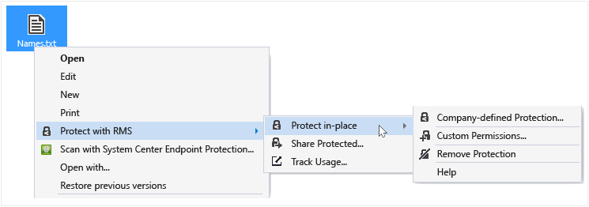

# Beskytte en fil p&#229; en enhed (beskytte lokal) ved hj&#230;lp af rettighedsstyring, der deler programmet
Når du beskytter en fil lokalt, erstatter den den oprindelige, ubeskyttede fil. Derefter kan du lade den fil, hvor det er, kopiere den til en anden mappe eller enhed eller dele den mappe, den er, og at filen forbliver beskyttede. Du kan også vedhæfte den beskyttede fil til en e-mail-meddelelse, selvom den anbefalede måde at dele en beskyttet fil via e-mail direkte fra Stifinder eller et Office-program (se [Beskytte en fil, som du deler via e-mail ved hjælp af rettighedsstyring, der deler programmet](../Topic/Protect_a_file_that_you_share_by_email_by_using_the_Rights_Management_sharing_application.md)).

> [!TIP]
> Hvis du kan se eventuelle fejl, når du forsøger at beskytte filer, se [ofte stillede spørgsmål om Microsoft Rights Management deling program til Windows](http://go.microsoft.com/fwlink/?LinkId=303971).

## At beskytte en fil på en enhed (beskytte på stedet)

1.  Filoversigt, Vælg en fil, der skal beskytte. Højreklik, Vælg **Beskyt med RMS**, og vælg derefter **beskytte lokal**. For eksempel:

    

    > [!NOTE]
    > Hvis du ikke kan se den **Beskyt med RMS** indstilling, er det sandsynligt, at enten RMS Deling af programmet ikke er installeret på computeren, eller computeren skal genstartes for at fuldføre installationen. Finde flere oplysninger om, hvordan du installere RMS deling program [Hent og installer den Rights Management, deling af program](../Topic/Download_and_install_the_Rights_Management_sharing_application.md).

2.  Benyt en af følgende:

    -   Vælg en skabelon for gruppepolitik: Det er foruddefinerede tilladelser, der typisk begrænser adgang og brug til personer i organisationen. Hvis organisationens navn er "Contoso, Ltd", kan du for eksempel se **Contoso, Ltd - kun fortrolige visning;**. Hvis det er første gang, du har beskyttet en fil på denne computer, skal du først markere **virksomhedsdefinerede beskyttelse** at hente skabelonerne.

        Næste gang du klikker på den **beskytte lokal** indstilling, kan du se op til 10 skabeloner at vælge imellem. Hvis der er mere end 10 tilgængelige skabeloner, og du vil ikke vises, skal du klikke på **virksomhedsdefinerede beskyttelse** til at hente og få vist alle skabelonerne.

        Når du vælger en politikskabelon, kan du også beskytte flere filer og en mappe. Når du vælger en mappe, vil alle filerne i mappen markeres automatisk for beskyttelse, men nye filer, du opretter i denne mappe ikke være automatisk beskyttet.

    -   Vælg **brugerdefinerede tilladelser**: Vælg denne indstilling, hvis skabelonerne, der ikke giver beskyttelsesniveauet, som du har brug for eller skal udtrykkeligt angive beskyttelsesindstillinger selv. Angiv de indstillinger, du vil bruge til denne fil i den [beskyttelse dialogboksen Tilføj](http://technet.microsoft.com/library/dn574738.aspx), og klik derefter på **Anvend**.

3.  Du kan hurtigt se en dialogboks for at fortælle dig, at filen beskyttes, og fokus vender derefter tilbage til Filoversigt. Den eller de markerede filer er nu beskyttet. I nogle tilfælde (når tilføjelse af beskyttelse, ændres filtypenavnet), erstattes den oprindelige fil i fil Explorer med en ny fil med Rights Management beskyttelse låseikonet. For eksempel:

    

Hvis du senere vil fjerne beskyttelsen fra en fil, kan du se [Fjerne beskyttelsen fra en fil ved hjælp af rettighedsstyring, der deler programmet](../Topic/Remove_protection_from_a_file_by_using_the_Rights_Management_sharing_application.md).

## Eksempler og andre instruktioner
I de følgende afsnit i brugervejledningen til deling program til Rights Management eksempler til hvordan du kan bruge den Rights Management, deling af programmer og vejledninger:

-   [Eksempler på brug af RMS deling program](../Topic/Rights_Management_sharing_application_user_guide.md#BKMK_SharingExamples)

-   [Hvad vil du gøre?](../Topic/Rights_Management_sharing_application_user_guide.md#BKMK_SharingInstructions)

## Se også
[Rights Management deling program bruger guide](../Topic/Rights_Management_sharing_application_user_guide.md)

