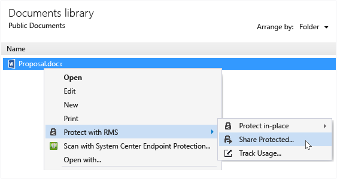
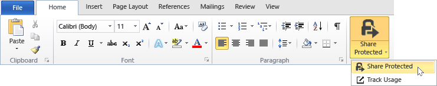

# Beskytte en fil, som du deler via e-mail ved hj&#230;lp af rettighedsstyring, der deler programmet
Når du beskytter en fil, som du deler via e-mail, oprettes der en ny version af den oprindelige fil. Den oprindelige fil forbliver ubeskyttet, og den nye version er beskyttet og automatisk vedhæftet en e-mail, som du derefter sende.

I nogle tilfælde (for filer, der er oprettet i Microsoft Word, Excel og PowerPoint), opretter RMS deling program to versioner af den fil, der føjer den til e-mail-meddelelsen. Den anden version af filen har en **.ppdf** -filtypenavn, og det er et PDF-øjebliksbillede af filen. Denne version af filen sikrer, at modtagerne kan altid læse filen, selvom de ikke har installeret det samme program, du brugte til at oprette den. Dette er ofte tilfældet, når brugerne læse deres e-mail-adresser på mobile enheder, og du vil se deres e-mail-vedhæftede filer. Alle de har brug for at åbne filen, er RMS deling program. Derefter kan de læse den vedhæftede fil, men de kan ikke ændre den, før de åbner anden versionen af filen ved hjælp af et program, der understøtter RMS.

Hvis din organisation bruger Azure RMS, du kan holde styr på de filer, der beskyttes ved at dele:

-   Vælg en indstilling for at modtage e-mails, når nogen forsøger at åbne disse vedhæftede filer beskyttet. Hver gang filen åbnes, får du besked, der har forsøgt at åbne filen, og hvornår, og om de var vellykket (de er blevet godkendt) eller ej.

-   Brug dokumentationen websted. Du kan endda stoppe deling af filen, ved at trække adgang til den på webstedet til registrering. Yderligere oplysninger finder du under [Spore og tilbagekalde dine dokumenter, når du bruger RMS deling program](../Topic/Track_and_revoke_your_documents_when_you_use_the_RMS_sharing_application.md).

## Ved hjælp af Outlook: At beskytte en fil, som du deler med e-mail

1.  Opret din e-mail-meddelelse, og vedhæft filen. Derefter på den **meddelelse** under fanen den **RMS** skal du klikke på **del beskyttet** og derefter klikke på **del beskyttet** igen:

    

    Hvis denne knap ikke vises, er det sandsynligt, at enten RMS Deling af programmet ikke er installeret på computeren, er ikke installeret den nyeste version eller computeren skal genstartes for at fuldføre installationen. Finde flere oplysninger om, hvordan du installerer programmet deling, [Hent og installer den Rights Management, deling af program](../Topic/Download_and_install_the_Rights_Management_sharing_application.md).

2.  Angiv de indstillinger, du vil bruge til denne fil i den [dele beskyttet dialogboksen](http://technet.microsoft.com/library/dn574738.aspx), og klik derefter på **Send nu**.

### Andre måder at beskytte en fil, som du deler med e-mail
Ud over at dele en beskyttet fil ved hjælp af Outlook, kan du også bruge disse alternativer:

-   Fra fil Explorer: Denne metode fungerer for alle filer.

-   Fra et Office-program: Denne metode fungerer for programmer, der understøtter RMS deling program ved hjælp af tilføjelsesprogrammet Office, så du kan se de **RMS** gruppe på båndet.

##### Ved hjælp af Stifinder eller et Office-program: At beskytte en fil, som du deler med e-mail

1.  Benyt en af følgende indstillinger:

    -   Til fil Explorer: Højreklik på filen, skal du vælge **Beskyt med RMS**, og vælg derefter **del beskyttet**:

        

    -   For de Office-programmer, Word, Excel og PowerPoint: Sørg for, at du har gemt filen først. Derefter på den **Home** under fanen den **RMS** skal du klikke på **del beskyttet** og derefter klikke på **del beskyttet** igen:

        

    Hvis du ikke kan se disse indstillinger for beskyttelse, er det sandsynligt, at enten RMS Deling af programmet ikke er installeret på computeren, er ikke installeret den nyeste version eller computeren skal genstartes for at fuldføre installationen. Finde flere oplysninger om, hvordan du installerer programmet deling, [Hent og installer den Rights Management, deling af program](../Topic/Download_and_install_the_Rights_Management_sharing_application.md).

2.  Angiv de indstillinger, du vil bruge til denne fil i den [dele beskyttet dialogboksen](http://technet.microsoft.com/library/dn574738.aspx), og klik derefter på **sende**.

3.  Du kan hurtigt se en dialogboks for at fortælle dig, at filen beskyttes, og derefter se du har oprettet en e-mail, der fortæller modtagerne, at de vedhæftede filer er beskyttet med Microsoft RMS, og at de skal logge på. Når de klikker på linket til at logge på, kan de se instruktioner og links til at sikre, at de kan åbne den vedhæftede fil beskyttet.

    Eksempel:

    

    Du tænker: [Hvad er den .ppdf-fil, der oprettes automatisk?](../Topic/Dialog_box_options_for_the_Rights_Management_sharing_application.md#BKMK_PPDF)

4.  Valgfrit: Du kan ændre noget, du vil have i e-mail-meddelelsen. For eksempel kan du føje til eller ændre emnelinjen eller teksten i meddelelsen.

    > [!WARNING]
    > Selvom du kan tilføje eller fjerne brugere fra denne e-mail-meddelelse, ændres dette ikke tilladelserne for den vedhæftede fil, du har angivet i den **del, der er beskyttet med** dialogboksen. Hvis du vil ændre tilladelserne, for eksempel give tilladelse til at åbne filen, skal du lukke e-mailen uden at gemme eller sende den til en ny person og vende tilbage til trin 1.

5.  Send e-mail-meddelelsen.

## Eksempler og andre instruktioner
I de følgende afsnit i brugervejledningen til deling program til Rights Management eksempler til hvordan du kan bruge den Rights Management, deling af programmer og vejledninger:

-   [Eksempler på brug af RMS deling program](../Topic/Rights_Management_sharing_application_user_guide.md#BKMK_SharingExamples)

-   [Hvad vil du gøre?](../Topic/Rights_Management_sharing_application_user_guide.md#BKMK_SharingInstructions)

## Se også
[Rights Management deling program bruger guide](../Topic/Rights_Management_sharing_application_user_guide.md)

