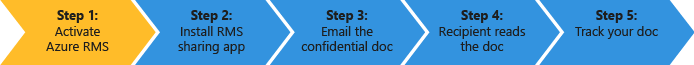

# Hurtig Start selvstudiet til Azure rettighedsstyring
Brug dette selvstudium til hurtigt at afprøve Microsoft Azure Rights Management (også kendt som Azure RMS) til din organisation med bare 5 trin, der skal tage mindre end 15 minutter. Du skal aktivere tjenesten, sikkert sende Fortroligt dokument via e-mail til nogen i en anden organisation, og derefter være i stand til at spore, når dokumentet åbnes. Når det fortrolige dokument er sendt, er krypteret, mens du er i transit, og kan kun læses af personen, der er sendt til, ved hjælp af de tilladelser, der er angivet af afsenderen.

Denne vejledning henvender sig til IT-administratorer og konsulenter, til at hjælpe dem med at evaluere Azure Rights Management som en løsning til beskyttelse af oplysninger for en organisation. Vejledningen for at aktivere tjenesten skal udføres af en administrator, og vejledningen for at sende dokumentet ville udføres af slutbrugere i et produktionsmiljø. Begge sæt instruktioner er medtaget i dette selvstudium til at demonstrere scenariet til slut sikkert sende Fortroligt dokument til nogen i en anden organisation. Hvis du har nogen problemer med at udføre dette selvstudium, skal du sende en e-mail til [AskIPTeam](mailto:askipteam@microsoft.com?subject=Having%20problems%20with%20the%20Quick%20Start%20tutorial) og vi vil hjælpe dig.

For at afslutte dette selvstudium, skal du have følgende:

-   Et abonnement, der understøtter rettighedsstyring Azure. Dette kan være et betalt abonnement eller et gratis prøveabonnement. Hvis du vil bruge dokumentsporing, der kræves til trin 5 i dette selvstudium, skal abonnementet understøtte dokument sporing. Finde flere oplysninger om indstillinger for abonnement og links til gratis forsøg på [Sky-abonnementer, der understøtter Azure RMS](../Topic/Requirements_for_Azure_Rights_Management.md#BKMK_SupportedSubscriptions) afsnit i den [Krav til Azure rettighedsstyring](../Topic/Requirements_for_Azure_Rights_Management.md) emne.

    Tip: Hvis du har brug at få et abonnement, gøres på forhånd, da denne proces kan sommetider tage et stykke tid at fuldføre.

-   En administratorkonto til at logge på Office 365 admin center eller Azure portal, så du kan aktivere Rights Management-tjenesten. Denne konto skal også have en e-mail-adresse og en fungerende e-mail-tjeneste (for eksempel Exchange Online eller Exchange Server).

-   En computer, der kører Windows (mindst Windows 7 SP1), og som har installeret Office 2016, 2013 Office eller Office 2010.

Lad os komme i gang.

## Trin 1: Aktivere tjenesten Rights Management

Selvom du kan have et abonnement, der understøtter rettighedsstyring Azure, er tjenesten deaktiveret som standard. For at aktivere den, kan du bruge Office 365 admin center eller Azure portal:

-   Hvis du har et abonnement på Office 365, der omfatter Azure rettighedsstyring, eller et abonnement på Office 365, der udelukker Azure Rights Management, men du har et abonnement til enkeltstående Azure RMS: **Bruger Office 365 admin center**.

-   Hvis du ikke har et abonnement på Office 365: **Bruger Azure portalen**.

#### At aktivere Rights Management på Office 365 admin-Center

1.  Gå til den [Office 365-portalen](https://portal.office.com/) og logge på med din konto til arbejdet eller skolen.

2.  Hvis Office 365 admin center ikke automatisk vises, Vælg ikonet app Opgavestarter i øverst til venstre og vælge **Admin**. Den **Admin** side om side vises kun til Office 365-administratorer.

    > [!TIP]
    > Admin center Hjælp finder du under [om på Office 365 admin center - Admin Hjælp](https://support.office.com/article/About-the-Office-365-admin-center-Admin-Help-58537702-d421-4d02-8141-e128e3703547).

3.  I venstre rude kan du udvide **Indstillinger for**.

4.  Klik på **Rights Management**.

5.  På den **RIGHTS MANAGEMENT** skal du klikke på **Manage**.

6.  På den **rettighedsstyring** skal du klikke på **aktivere**.

7.  Når du bliver bedt om **vil du aktivere Rights Management?**, skal du klikke på **aktivere**.

Du kan nu se **Rights management er aktiveret** og mulighed for at deaktivere (du skal muligvis opdatere siden manuelt)

På nuværende tidspunkt ikke klikker på **Avancerede funktioner til**. Du kommer til Azure portal hvor du kan konfigurere skabeloner, der ikke medgår til dette selvstudium. I stedet kan du lukke Office 365 admin center.

#### At aktivere Rights Management fra Azure portal

1.  Gå til den [Azure portal](http://go.microsoft.com/fwlink/p/?LinkID=275081) og logge på.

2.  Klik på i venstre rude, **ACTIVE DIRECTORY**.

3.  Fra den **active directory** skal du klikke på **RIGHTS MANAGEMENT**.

4.  Vælg mappe til at administrere for [!INCLUDE[aad_rightsmanagement_2](../Token/aad_rightsmanagement_2_md.md)], skal du klikke på **Aktiver**, og derefter bekræfte din handling.

Den **RIGHTS MANAGEMENT STATUS** skal nu vise **aktive** og **Aktiver** erstattes af **Deaktiver**.

Selvom du kan konfigurere andre indstillinger for (Rights Management) på portalen, er disse ikke nødvendig for dette selvstudium, så du kan lukke Azure portal.

Det er alt du skal gøre for dette første trin. Tjenesten er aktiveret, så alle brugere i organisationen kan nu begynde at beskytte vigtige og følsomme dokumenter. I et produktionsmiljø vil du begrænse, hvem der kan gøre dette i første omgang for en faseinddelt udrulning. Men det er ikke nødvendigt i dette selvstudium.

Selvom der ikke er medtaget her, til et produktionsmiljø, vil du sandsynligvis også til at konfigurere brugerdefinerede skabeloner. Skabeloner gør det lettere for brugerne at anvende de rigtige indstillinger hurtigt, når de har brug for til at beskytte filer. Når du aktiverer rettighedsstyring, får du automatisk 2 standardskabeloner, og sandsynligvis vil du supplere med dine egne skabeloner i et produktionsmiljø. Men skabeloner er ikke nødvendig for dette selvstudium, så du er klar til at gå til næste trin.

|Hvis du vil have yderligere oplysninger.|Yderligere oplysninger|
|--------------------------------------------|--------------------------|
|Om aktivering Rights Management og styre, hvem der kan beskytte aktiveret filer og e-mail, når tjenesten er →|[Aktivering af Azure rettighedsstyring](../Topic/Activating_Azure_Rights_Management.md)|
|Om standardskabeloner og oprettelse af nye, brugerdefinerede skabeloner →|[Konfiguration af brugerdefinerede skabeloner til Azure rettighedsstyring](../Topic/Configuring_Custom_Templates_for_Azure_Rights_Management.md)|

## Trin 2: Installere den Rights Management, deling af program

Den rettighedsstyring deling program (også kaldet "RMS deling app") er ikke et krav om Azure Rights Management, men vi anbefaler det til alle computere og mobile enheder, der understøtter rettighedsstyring Azure. RMS, der deler programmet integreres med Office programmer ved at installere en Office-tilføjelsesprogrammet, så brugerne let kan beskytte filer direkte fra båndet. Det gør det også muligt at beskytte alle filtyper ved at anvende generisk beskyttelse af filer, der ikke har indbygget understøttelse af Azure Rights Management og et dokument, websted for brugere at registrere og fjerne filer, som de har beskyttet. Vi bruger dokumentsporing webstedet senere i dette selvstudium.

Dette program er gratis at hente og tilbyder en scriptbaseret installation til produktionsmiljøer. Men i dette selvstudium, vi kan installere det lokalt.

#### Sådan hentes og installeres den Rights Management, deling af program

1.  Gå til den [Microsoft Rights Management](http://go.microsoft.com/fwlink/?LinkId=303970) side på Microsofts websted.

2.  I den **computere** Klik på ikonet for den **RMS-app til Windows** og gemme den **Setup.exe** fil for at installere Microsoft Rights Management deling program.

3.  En lokal installation, skal du bruge en administratorkonto til at køre filen Setup.exe, der blev hentet. Hvis du bliver bedt om at fortsætte, skal du klikke på **Ja**.

4.  På den **installationsprogrammet Microsoft RMS** skal du klikke på **Næste**, og vente på færdiggørelse af installationen.

5.  Når installationen er færdig, skal du klikke på **genstarte** Hvis du bliver bedt om at genstarte computeren, eller klik på  **Luk** at fuldføre installationen.

Du er nu klar til at beskytte filer, der indeholder oplysninger, som du vil dele, men kun med de personer, du angiver.

|Hvis du vil have yderligere oplysninger.|Yderligere oplysninger|
|--------------------------------------------|--------------------------|
|Om en lokal installation af den deling ansøgning om Windows og bruger vejledningen → rettighedsstyring|[Rights Management deling program bruger guide](http://technet.microsoft.com/library/dn339006.aspx)|
|Om scriptbaseret installation af den Deling af program til Windows og flere tekniske oplysninger → rettighedsstyring|[Rights Management deling program administratorvejledningen](http://technet.microsoft.com/library/dn339003.aspx)|
|At forstå forskellen mellem native beskyttelse og generel beskyttelse →|[Hvad er forskellen mellem generiske beskyttelse og indbygget (standard) beskyttelse?](https://technet.microsoft.com/library/dn574738.aspx)|

## Trin 3: Send en e-mail til dit dokument, som du vil beskytte

I dette trin skal først oprette og gemme et dokument med Word, der repræsenterer dit dokument, som du vil beskytte, og giv det navnet **Confidential.docx**. Det er ligegyldigt hvilken den faktisk indeholder tekst i dette selvstudium, men du vil ønsker at være noget tekst, så du lettere kan bekræfte, at den godkendte modtager kan læse den. Du kan f.eks. **Hvis kan du læse fra din e-mail-vedhæftede filer, har afsenderen har delt en fil, der er beskyttet med Azure RMS.**

Du er derefter klar til at dele dokumenter sikkert via e-mail.

#### Til sikkert at dele dit dokument via e-mail

1.  Ved hjælp af Outlook, oprette en ny meddelelse, og vedhæft den fil, du lige har oprettet.

2.  I den **til** Skriv en eller flere business e-mail-adresser. Kontroller, at du angiver en adresse til e-mail, f.eks **janetm@contoso.com** eller **p.dover@fabrikam.com** fordi Azure Rights Management ikke i øjeblikket understøtter personlige e-mail-adresser, som du kan bruge hjemme fra din Internet-udbyder. Ikke noget om, hvorvidt den person, du sender den til også har Azure rettighedsstyring, eller ikke.

3.  Skriv et emne, som  **fortrolige dokument** og derefter skrive en kort meddelelse til e-mail, f.eks **Læs dette fortrolige dokument og ikke dele den med andre.**

4.  Derefter på den **meddelelse** under fanen den **RMS** skal du klikke på **del beskyttet** og derefter klikke på **del beskyttet** igen:

5.  I den **del, der er beskyttet med** dialogboks:

    1.  Vælg **Fremviser – få kun vist**.

        Det betyder, at vores modtagere vil kunne få vist dokumentet, men ikke redigere eller udskrive den.

    2.  Vælg **E-mail til mig, når nogen forsøger at åbne dokumenterne**.

        Får du en e-mail-besked hver gang modtagerne, der forsøger at åbne den vedhæftede fil, og hvis en anden forsøger at åbne den – for eksempel modtageren videresender e-mail til kollega. I dette sidste eksempel, kan du se, blev nægtet adgang og fra oplysninger om bruger, kan du beslutte, om at sende personen en kopi af dokumentet, kan de åbne.

    3.  Vælg **Lad mig straks at tilbagekalde adgang til disse dokumenter**.

        Denne indstilling kræver, at modtagerne skal have en internetforbindelse, hver gang de åbner den vedhæftede fil, men med fordelen, hvis du senere fortryder dokumentet, næste gang de forsøger at åbne den, de ikke vil kunne. Hvis du ikke vælger denne indstilling, kan modtagerne kunne åbne den selv uden en internetforbindelse, men med den ulempe, at hvis du senere fortryder dokumentet, der kan være en forsinkelse for hvornår, der træder i kraft.

    4.  Klik på **sender nu**.

        E-mail med vedhæftet fil sendes til de e-mail-adresser, du har angivet. Ud over din e-mail-meddelelse, kan de se instruktioner hvordan du læser det vedhæftede dokument, der er beskyttet af Azure Rights Management.

Nu du har sendt dokumentet beskyttet, er du klar til at anmode modtagerne til at vente på at ankomme og derefter åbne den. Men ikke lukke Outlook, fordi vi skal bruge den igen i vores sidste trin til at spore den vedhæftede fil.

|Hvis du vil have yderligere oplysninger.|Yderligere oplysninger|
|--------------------------------------------|--------------------------|
|Fuld instruktioner og alternative metoder til at beskytte filer, som deles via e-mail →|[Beskytte en fil, som du deler via e-mail ved hjælp af rettighedsstyring, der deler programmet](https://technet.microsoft.com/library/dn574735.aspx)|
|Om indstillingerne i den **del, der er beskyttet med** dialogboksen →|[Dialogboksens indstillinger for rettighedsstyring, der deler programmet](https://technet.microsoft.com/library/dn574738.aspx)|

## Trin 4: Spørg modtagerne til at åbne det dokument, der er sendt

Modtagerne kan bruge mange enheder til at læse det beskyttede dokument, der er sendt som en vedhæftet e-mail. Enhederne, der omfatter iPads, iPhones, Android tabletter og telefoner, Mac-computere samt Windows-computere.

Bed dem om at læse den e-mail, du har sendt. De vil se din e-mail-meddelelse, og før den følgende tekst:

**Afsenderen er beskyttet med Microsoft RMS vedhæftede filer. Skal du** [logge på](http://aka.ms/rms) **til at åbne dem.**

Når de klikker på linket, det tager dem at instruktionerne for at installere RMS deling app og log for en gratis konto. Gratis konto giver dem et abonnement til RMS for personer, der sikrer, at autoriserede brugere kan altid få et beskyttet dokument, selvom deres organisation ikke har Azure RMS. De er derefter klar til at læse den vedhæftede fil beskyttet ved hjælp af følgende instruktioner.

#### Sådan får du vist den vedhæftede fil i en beskyttet dokument.

1.  Da Azure Rights Management beskyttet et Word-dokument, er der to vedhæftede filer i e-mailen. Det er faktisk to versioner af den samme fil, men med forskellige filtypenavne. Åbne den version, der har den **.ppdf** filtypenavn (**Confidential.ppdf**).

    Hvis du har en version af [Office på enheden, der understøtter rettighedsstyring](https://technet.microsoft.com/library/dn655136.aspx), kan du åbne anden versionen af filen (**Confidential.docx**), så den åbnes i Word.

2.  Hvis du bliver bedt om dit brugernavn og din adgangskode, kan du angive dit brugernavn i samme format som den e-mail-adresse, der blev brugt til at sende en e-mail og vedhæftede filer. For eksempel **janetm@contoso.com** eller **p.dover@fabrikam.com**. Skriv den adgangskode, du angav, da du tilmeldte dig RMS for personer, om din adgangskode. Eller hvis din organisation har Azure RMS, angive adgangskoden til normale arbejde.

Dokumentet åbnes, og du kan nu læse indholdet. Det kan for eksempel sige **Hvis kan du læse fra din e-mail-vedhæftede filer, har afsenderen blev delt en fil, der er beskyttet med Azure RMS.** Fordi den er skrivebeskyttet, kan du ikke ændre indholdet.

Som et valgfrit trin, kan du bede til at videresende e-mail til andre personer, som du ikke har medtaget i din oprindelige e-mail-modtageren. Selvom de andre personer, der arbejder i en organisation, der har Azure Rights Management, eller de anvender til deres egne RMS for enkeltpersoner-abonnement, kan de ikke åbne den vedhæftede fil. Når de er forfremmet til deres brugernavn, nægtes adgang til dokumentet.

Nu, hvor modtageren har åbnet den vedhæftede fil og eventuelt videresendes den til en anden, kan du forvente at få en e-mail-meddelelser, som rapporterer denne aktivitet. Men e-mails er let at miste over tid, så en bedre måde at spore, hvem der har adgang til dokumentet er at bruge dokumentet websted, der er omfattet i det sidste trin.

|Hvis du vil have yderligere oplysninger.|Yderligere oplysninger|
|--------------------------------------------|--------------------------|
|Fuld instruktioner for at få vist filer, der er beskyttet af Azure Rights Management →|[Få vist og bruge filer, der er beskyttet med Rights Management](https://technet.microsoft.com/library/dn574741.aspx)|
|Om det gratis abonnement RMS til enkeltpersoner →|[RMS for enkeltpersoner og Azure rettighedsstyring](../Topic/RMS_for_Individuals_and_Azure_Rights_Management.md)|
|Om de to versioner af filen, du ser, der er knyttet til e-mail →|[Hvad er den .ppdf-fil, der oprettes automatisk?](https://technet.microsoft.com/library/dn574738.aspx)|

## Trin 5: Styr dine beskyttede dokumenter

> [!NOTE]
> For dette trin, skal du have et abonnement, der understøtter registrering af dokumentet. For at se, om dit abonnement omfatter dokumentsporing, kan [tilbud på sammenligning af Rights Management Services (RMS)](https://technet.microsoft.com/dn858608.aspx).

Dette trin er valgfrit, men de fleste mennesker kan lide at vide, hvis den vedhæftede fil, de har sendt til personer er blevet åbnet, når og hvor selv fra. For eksempel:

-   Du forventer et svar fra nogen af et bestemt tidspunkt, og du kan se fra registreringswebstedet dokument, at hun ikke har åbnet dokumentet, selvom deadline nærmer. Du kan sende hende et opfølgende e-mail eller ringe til hende som en rettidig påmindelse.

-   Efter disses, at nogen har åbnet dokumentet, følge op for at bede sin Hvis hun har nogen spørgsmål eller kræver yderligere oplysninger.

#### Til at spore dine beskyttede dokumenter

1.  Ved hjælp af Outlook, på den **Home** under fanen den **RMS** skal du klikke på **Spor Brug**.

2.  Hvis du kan se de **Beskyt og del på dine vilkår** skal du klikke på **logge på** og angive dit brugernavn og din adgangskode igen.

3.  På den **delte dokumenter** side, kan du se det dokument, der er vedhæftet e-mailen, **Confidential.docx**. Det er den eneste fil, der vises på dette tidspunkt, men som du deler flere beskyttede dokumenter, på listen vil vokse.

    Fra denne side kan du se, når du har delt (når du har sendt e-mailen med den vedhæftede fil beskyttet), datoen for den sidste aktivitet og navnet på den modtager, du har sendt e-mail til. Klik på dokumentnavnet for at få yderligere oplysninger.

4.  På den nye side, som har navnet på den fil, du har klikket på, får du vist en oversigt over detaljerne for det pågældende dokument kun, og en liste over andre indstillinger, der er tilgængelige for dokumentet (**liste over**, **tidslinje**, **kort**, **indstillinger**).

    Klik på hver enkelt indstilling til at udforske måder til at spore dine beskyttede dokumenter. Eller stadig på den **Oversigt** skal du klikke på **Åbn i Excel** til at eksportere oplysninger til et regneark, eller klik på **tilbagekalde adgang** du stoppe deling af dokumentet.

Du kan vende tilbage til dette websted til at spore yderligere aktivitet til et beskyttet dokument eller tilbagekalde adgang, hvis det er nødvendigt. Du kan også åbne webstedet fra din mobile enhed eller tablet, ved hjælp af en webbrowser med dette link: [dokumentsporing](http://go.microsoft.com/fwlink/?LinkId=529562)

|Hvis du vil have yderligere oplysninger.|Yderligere oplysninger|
|--------------------------------------------|--------------------------|
|Fuld instruktioner til at spore dine dokumenter →|[Spore og tilbagekalde dine dokumenter, når du bruger RMS deling program](https://technet.microsoft.com/library/dn986611.aspx)|
|To minutters video, der forklarer og viser dokumentsporing →|[Sporing af Azure RMS-dokument og tilbagekaldelse](http://channel9.msdn.com/Series/Information-Protection/Azure-RMS-Document-Tracking-and-Revocation)|
|For fejlfinding, og kunden spørgsmål →|[Ofte stillede spørgsmål om sporing af dokument](https://technet.microsoft.com/dn947488)|

## Næste trin
Dette selvstudium forskydninger gennem blot ét scenario for hvordan Azure RMS kan hjælpe med at beskytte dine data. Andre almindelige anvendelser, finder du på [Azure RMS i aktion](https://technet.microsoft.com/library/jj585026.aspx) afsnit fra den [Hvad er Azure Rights Management?](../Topic/What_is_Azure_Rights_Management_.md) artikel. Der er andre afsnit i denne artikel, kan også være nyttige, hvordan Azure RMS fungerer, og hvilke virksomhedsproblemer kan det løse.

Hvis du er klar til at installere RMS Azure, brug af [Køreplan for Azure Rights Management installation](../Topic/Azure_Rights_Management_Deployment_Roadmap.md) for installationen trin og links til vejledninger.

## Se også
[Introduktion til Azure rettighedsstyring](../Topic/Getting_Started_with_Azure_Rights_Management.md)

