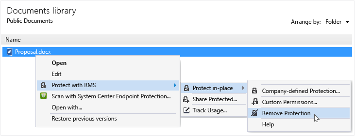

# Fjerne beskyttelsen fra en fil ved hj&#230;lp af rettighedsstyring, der deler programmet
Fjerne beskyttelsen fra en fil (dvs., Fjern en fil), der tidligere var beskyttet ved hjælp af RMS Deling af programmet, skal du bruge den **fjerne beskyttelse** indstilling fra Filoversigt.

> [!IMPORTANT]
> Du skal være en ejer af filen for at fjerne beskyttelsen.

### Fjerne beskyttelsen fra en fil

1.  Fra Stifinder, højreklik på filen (for eksempel Sample.ptxt), skal du vælge **Beskyt med RMS**, skal du klikke på **beskytte lokal**, og klik derefter på **fjerne beskyttelse**:

    

    Du kan blive bedt om legitimationsoplysninger.

Den oprindelige beskyttede fil slettes (f.eks, Sample.ptxt) og erstattet med en fil, der har samme navn, men med ubeskyttede filtypenavnet (for eksempel Sample.txt).

## Eksempler og andre instruktioner
I de følgende afsnit i brugervejledningen til deling program til Rights Management eksempler til hvordan du kan bruge den Rights Management, deling af programmer og vejledninger:

-   [Eksempler på brug af RMS deling program](../Topic/Rights_Management_sharing_application_user_guide.md#BKMK_SharingExamples)

-   [Hvad vil du gøre?](../Topic/Rights_Management_sharing_application_user_guide.md#BKMK_SharingInstructions)

## Se også
[Rights Management deling program bruger guide](../Topic/Rights_Management_sharing_application_user_guide.md)

