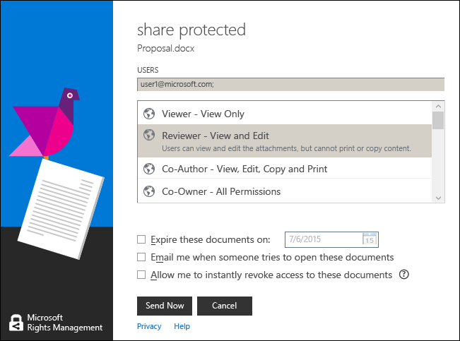

# Bruge tastaturgenveje i rettighedsstyring, der deler programmet
Når du bruger RMS Deling af programmet, skal du trykke på **Alt** for at få vist de tilgængelige hurtigtaster, og tryk derefter på **Alt** + nøglen adgang til at vælge en indstilling.

I den **del, der er beskyttet** dialogboksen, tryk på **Alt** se hurtigtasterne, og tryk derefter på **Alt + m** til at vælge den **e-mail-besked, når nogen forsøger at åbne dokumenterne** afkrydsningsfelt.

## Eksempler og andre instruktioner
I de følgende afsnit i brugervejledningen til deling program til Rights Management eksempler til hvordan du kan bruge den Rights Management, deling af programmer og vejledninger:

-   [Eksempler på brug af RMS deling program](../Topic/Rights_Management_sharing_application_user_guide.md#BKMK_SharingExamples)

-   [Hvad vil du gøre?](../Topic/Rights_Management_sharing_application_user_guide.md#BKMK_SharingInstructions)

## Se også
[Rights Management deling program bruger guide](../Topic/Rights_Management_sharing_application_user_guide.md)

