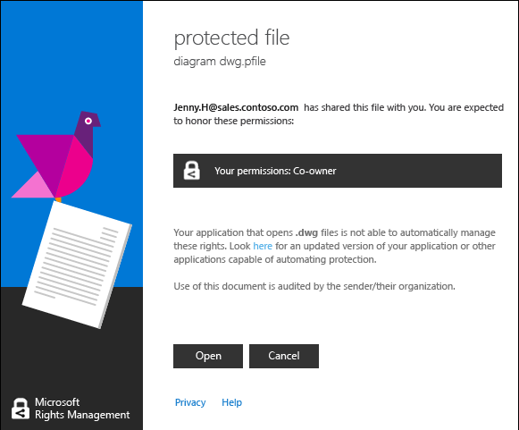

# F&#229; vist og bruge filer, der er beskyttet med Rights Management
Når den [Rights Management (RMS) dele af programmet er installeret på din computer](https://technet.microsoft.com/library/dn574734%28v=ws.10%29.aspx), du får vist en beskyttet fil ved at dobbeltklikke på den. Filen kan være en vedhæftet fil i en e-mail, eller du kan se den, når du bruger Filoversigt.

> [!NOTE]
> Før du kan få vist den beskyttede fil, skal RMS først bekræfte, at du har tilladelse til at få vist filen, som det er tilfældet ved at kontrollere dit brugernavn og din adgangskode. I nogle tilfælde kan det blive cachelagret og vises ikke en meddelelse, der spørger om dine legitimationsoplysninger. I andre tilfælde bliver du bedt om at angive dine legitimationsoplysninger.
> 
> Hvis organisationen ikke bruger enten Azure Rights Management (Azure RMS) eller AD RMS, kan du ansøge om en gratis konto, der accepterer dine legitimationsoplysninger, så du kan åbne filer, der er beskyttet ved hjælp af RMS:
> 
> -   Gælder for denne konto, skal du klikke på linket til at ansøge om [RMS for personer,](http://go.microsoft.com/fwlink/?LinkId=309469).
> 
>     Når du tilmelder dig, kan du bruge din virksomheds e-mail-adresse i stedet for en personlig e-mail-adresse. Hvis du tilmelder dig, da du blev sendt med e-mail vedhæftet fil i en beskyttet, kan du bruge den samme e-mail-adresse, der blev brugt til at sende e-mailen.
> -   Yderligere oplysninger finder du i [RMS for enkeltpersoner og Windows Azure Rights Management](http://technet.microsoft.com/library/dn592127.aspx).

## Sådan får du vist en beskyttet fil
Dobbeltklik på den beskyttede fil via Stifinder eller den e-mail, der indeholder den vedhæftede fil, og Angiv dine legitimationsoplysninger, hvis du bliver bedt om at gøre dette.

Hvis du ser to versioner af filen, men med forskellige filtypenavne, Åbn den fil, der har filtypenavnet .ppdf kun, hvis anden fil ikke åbnes. Hvis du ikke kan åbne versionen af .ppdf enten, først installere de [RMS deling program](http://technet.microsoft.com/library/dn574734.aspx), som ved, hvordan du kan åbne filer med filtypenavnet .ppdf.

> [!NOTE]
> Yderligere oplysninger finder du under "[Hvad er den .ppdf-fil, der oprettes automatisk?](../Topic/Dialog_box_options_for_the_Rights_Management_sharing_application.md#BKMK_PPDF)".

Hvordan filen skal åbnes, afhænger af, hvordan den er beskyttet, som du kan se ved at kigge på filtypenavnet. Åbne filen i hvert enkelt tilfælde kan overvåges og forbliver overvåget, så længe den er beskyttet. Desuden, hvis filen blev sendt som en vedhæftet e-mail, afsenderen muligvis besked pr. e-mail hver gang du åbner filen.

|Filtypenavn og beskyttelse|Yderligere oplysninger|
|------------------------------|--------------------------|
|Filen har en **.pfile** filtypenavn.  Filen er generisk beskyttet.|Når du åbner filen, kan du se en **beskyttet fil** dialogboksen fra programmet deling, der fortæller dig, der har beskyttet fil, og du forventes at imødekomme medejer-tilladelser. Klik på **åbne** at læse filen.  |
|Filen har en **.ppdf** filtypenavn eller er en beskyttet fil i tekst eller billede (f.eks **.ptxt** eller **.pjpg**).  Filen har oprindeligt beskyttet som en skrivebeskyttet kopi.|Filen åbnes ved hjælp af viewer, som installeres med RMS deling program. Denne fil er skrivebeskyttet, selvom du gemmer den til en anden placering eller omdøbe den.|
|Andre filtypenavne.  Filen har oprindeligt beskyttet.|Filen åbnes ved hjælp af det program, der er knyttet til det oprindelige filtypenavn, og begrænsning banner vises øverst i filen. Banneret kan du få vist de tilladelser, der gælder for fil, eller det kan indeholde et hyperlink for at få dem vist. For eksempel vises følgende hvor du skal klikke på **er i øjeblikket begrænset tilladelse** at se de faktiske tilladelser, der gælder for filen og de personer, der har adgang til den:  |
Du kan finde en komplet liste over filtypenavne, der understøtter rettighedsstyring, i den [Understøttede filtyper og filtypenavne](../Topic/Rights_Management_sharing_application_administrator_guide.md#BKMK_SupportFileTypes) sektioner i den  [Rights Management deling program administratorvejledningen](../Topic/Rights_Management_sharing_application_administrator_guide.md). Hvis din filtypenavn ikke vises, kan du bruge en søgning på internettet for at se, om det er et filtypenavn, der understøttes af et andet program.

> [!NOTE]
> Hvis, når du har bekræftet, at filen er beskyttet med Rights Management, og at filen ikke åbnes, skal du hente og bruge den [RMS Analyzer-værktøj](https://www.microsoft.com/en-us/download/details.aspx?id=46437). Følg vejledningen i værktøjet til at søge efter problemer på computeren, der kan forhindre et beskyttet dokument åbnes.

## Bruge filer, der er beskyttet (for eksempel, Rediger og Udskriv til fil)
Hvis når du har åbnet den beskyttede fil, du vil mere end blot læse den (for eksempel, redigere, kopiere og udskrive den):

|Filtypenavn|Vejledning|
|---------------|--------------|
|Filen har en **.pfile** filtypenavn.|Gem den åbne fil, og giv den et nyt filtypenavn, der er knyttet til det program, du vil bruge.  For eksempel hvis en fil er beskyttet ved hjælp af filen navnet document.vsdx.pfile, se filen og gemme filen i Filoversigt, som document.vsdx.  Den nye fil er ikke længere beskyttet. Hvis du vil beskytte den, skal du gøre det manuelt. Yderligere oplysninger finder du [Beskytte en fil på en enhed &#40;beskytte lokal&#41; ved hjælp af rettighedsstyring, der deler programmet](../Topic/Protect_a_file_on_a_device__protect_in-place__by_using_the_Rights_Management_sharing_application.md).|
|Filen har en **.ppdf** filtypenavn eller er en beskyttet fil i tekst eller billede (f.eks **.ptxt** eller **.pjpg**).|Du kan kun få vist filen, og hvis du omdøber eller flytter den, forbliver beskyttelse med filen.|
|Andre filtypenavne.|Enheden skal have et program, der forstår Rights Management til at bruge disse filer. Disse programmer kaldes RMS-enlightened programmer. Programmer fra Office 2016, 2013 Office og Office 2010 (som Word, Excel, PowerPoint og Outlook) er eksempler på programmer, der er enlightened til Rights Management. Men programmer, der ikke kommer fra Microsoft, som andre softwarevirksomheder og dine egne line of business-programmer kan også enlightened til Rights Management.  Programmer, der er enlightened til Rights Management ved, hvordan du åbner filer, der er beskyttet af andre Rights Management enlightened programmer. De også fortsætter den beskyttelse, der gælder for dem, selvom du kan redigere filen eller gemme den et andet navn eller en anden placering. Disse programmer kan du bruge filen i henhold til de tilladelser, der er udlignet til fil, så hvis du har tilladelse til at bruge filen, kan du gøre det. For eksempel, du muligvis redigere filen, men udskrives ikke.|

## Eksempler og andre instruktioner
I de følgende afsnit i brugervejledningen til deling program til Rights Management eksempler til hvordan du kan bruge den Rights Management, deling af programmer og vejledninger:

-   [Eksempler på brug af RMS deling program](../Topic/Rights_Management_sharing_application_user_guide.md#BKMK_SharingExamples)

-   [Hvad vil du gøre?](../Topic/Rights_Management_sharing_application_user_guide.md#BKMK_SharingInstructions)

## Se også
[Rights Management deling program bruger guide](../Topic/Rights_Management_sharing_application_user_guide.md)

