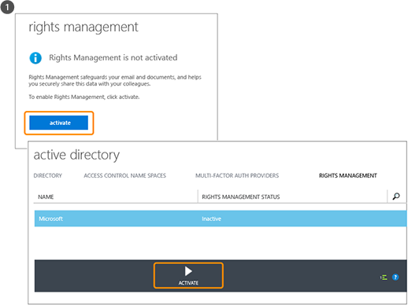
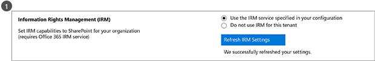

# Hvad er Azure Rights Management?
Azure Rights Management (Azure RMS) er en løsning til beskyttelse af oplysninger til virksomheder, der ønsker at beskytte deres data i vore dages udfordrende arbejdsmiljø.

Disse udfordringer kan nævnes behovet for at være forbundet til internettet, med brugere, der skal bringe personlige enhed skal fungere, adgang til virksomhedsdata på vej og hjem og deler følsomme oplysninger med vigtige forretningspartnere. Som en del af deres daglige arbejde, brugere dele oplysninger via e-mail, fildeling steder og cloud services. I disse scenarier, har traditionelle sikkerhedskontrol (såsom adgangskontrollister og NTFS-tilladelser) og firewalls begrænset effektivitet, hvis du vil beskytte virksomhedens data, mens du stadig gøre det muligt for brugerne at arbejde effektivt.

Azure RMS kan beskytte din virksomheds følsomme oplysninger i disse scenarier til sammenligning. Det bruger kryptering, identitet og politikker for tilladelse til at beskytte dine filer og e-mail, og det virker på tværs af flere enheder – telefoner, tabletter, og pc'er. Oplysninger kan beskyttes inden for organisationen for såvel som uden for virksomheden, da denne beskyttelse forbliver med dataene, selv når den forlader din organisations grænser. Medarbejdere kan e-maile et dokument til en partnervirksomhed som et eksempel, eller de gemmer et dokument til deres cloud-drev. Den vedvarende beskyttelse i Azure RMS ikke kun hjælper med at beskytte virksomhedens data, men kan også være juridisk godkendt til overholdelse, juridiske krav eller blot god forvaltningspraksis.

Men meget ikke mindst autoriserede personer og tjenester (f.eks. søgning og indeksering) kan fortsætte med at læse og inspicere de data, der beskytter Azure RMS, som ikke let ved hjælp af andre løsninger til beskyttelse af oplysninger, der bruger peer-to-peer-kryptering. Denne mulighed kaldes undertiden "Kognitiv over data" og er et afgørende element i vedligeholdelsen styringen af organisationens data.

Følgende billede viser, hvordan Azure RMS fungerer som en løsning til administration af rettigheder til Office 365 samt til lokale servere og tjenester. Du kan også se, at den understøtter de populære slutbruger enheder, der kører Windows, Mac OS, iOS, Android og Windows Phone.

> [!TIP]
> På dette tidspunkt nyttige ekstra ressourcer:
> 
> -   To minutter video: [Hvad er Microsoft Azure Rights Management](http://technet.microsoft.com/dn833005.aspx)
> -   Selvstudium i fem trin: [Hurtig Start selvstudiet til Azure rettighedsstyring](../Topic/Quick_Start_Tutorial_for_Azure_Rights_Management.md)
> -   Azure RMS-krav, herunder indstillinger for abonnement for at købe eller evaluere: [Krav til Azure rettighedsstyring](../Topic/Requirements_for_Azure_Rights_Management.md)

Du kan bruge de følgende afsnit vil vide mere om Azure RMS:

-   [Hvilke problemer betyder Azure RMS løses?](../Topic/What_is_Azure_Rights_Management_.md#BKMK_RMSrequirements)

    -   [Sikkerhed, overholdelse og lovgivningsmæssige krav](../Topic/What_is_Azure_Rights_Management_.md#BKMK_RMScompliance)

-   [Azure RMS i aktion: Se, hvad administratorer og brugere](../Topic/What_is_Azure_Rights_Management_.md#BKMK_RMSpictures)

    -   [Aktivering og konfiguration af rettighedsstyring](../Topic/What_is_Azure_Rights_Management_.md#BKMK_Example_ManagementPortal)

    -   [Automatisk beskytte filer på filservere, der kører Windows Server og fil klassificering infrastruktur](../Topic/What_is_Azure_Rights_Management_.md#BKMK_Example_FCI)

    -   [Automatisk beskytter e-mails med Exchange Online og forebygge tab af Datapolitikker](../Topic/What_is_Azure_Rights_Management_.md#BKMK_Example_DLP)

    -   [Automatisk beskytte filer med SharePoint Online og beskyttede biblioteker](../Topic/What_is_Azure_Rights_Management_.md#BKMK_Example_SharePoint)

    -   [Brugere dele vedhæftede filer sikkert med mobile brugere](../Topic/What_is_Azure_Rights_Management_.md#BKMK_Example_SharingApp)

-   [Hvordan fungerer Azure RMS? Under motorhjelmen](../Topic/What_is_Azure_Rights_Management_.md#BKMK_HowRMSworks)

    -   [Kryptografiske kontrolelementer, der bruges af Azure RMS: Algoritmer og nøglelængder](../Topic/What_is_Azure_Rights_Management_.md#BKMK_RMScrytographics)

    -   [Gennemgang af, hvordan Azure RMS fungerer: Første brug, beskyttelse af indhold forbrug af indhold](../Topic/What_is_Azure_Rights_Management_.md#BKMK_Walthrough)

-   [Næste trin](../Topic/What_is_Azure_Rights_Management_.md#BKMK_NextSteps)

## Hvilke problemer betyder Azure RMS løses?
Brug tabellen nedenfor til at identificere virksomhedens behov eller problemer, der kan have din organisation, og hvordan Azure RMS kan håndtere disse.

|Krav eller problem|Løses ved Azure RMS|
|----------------------|-----------------------|
|Beskytte alle filtyper|√ i forrige implementering af Rights Management, kun Office filer kan beskyttes, med indbygget beskyttelse. Nu, [generiske beskyttelse](https://technet.microsoft.com/library/dn574738%28v=ws.10%29.aspx) betyder, at alle filtyper understøttes.|
|Beskytte filer overalt|√, når en fil gemmes på en placering ([beskytte lokal](https://technet.microsoft.com/library/dn574733%28v=ws.10%29.aspx)), forbliver beskyttelse med fil, selvom den er kopieret til oplagring, ikke der styres af IT som en sky opbevaring.|
|Dele filer sikkert via e-mail|√, når en fil er delt via e-mail ([del, der er beskyttet med](https://technet.microsoft.com/library/dn574735%28v=ws.10%29.aspx)), filen er beskyttet som en vedhæftet fil til en e-mail med instruktioner hvordan du åbner den vedhæftede fil beskyttet. E-mail-teksten er ikke krypteret, så modtageren kan altid læse disse instruktioner. Men da det vedhæftede dokument er beskyttet, kun autoriserede brugere vil kunne åbne den, selvom e-mail eller dokument er videresendt til andre.|
|Overvågning og kontrol|√ Du kan [teste og overvåge brugen af](https://technet.microsoft.com/library/dn529121.aspx) af dine beskyttede filer, selv når disse filer forlader din organisations grænser.  For eksempel, arbejder du for Contoso Ltd. Du arbejder på et fælles projekt med 3 personer fra Fabrikam, Inc. Du e-mail disse 3 personer til et dokument, som du har beskyttet og begrænse til skrivebeskyttet. Overvågning af Azure RMS kan give følgende oplysninger:  -   Om de personer, du har angivet i Fabrikam har åbnet dokumentet, og hvornår. -   Om andre personer, som du ikke angav forsøgte (og mislykkedes) til at åbne dokumentet – måske fordi det blev videresendt eller gemt på en delt placering, som andre kan få adgang til. -   Om nogen af de angivne personer har prøvet (og mislykkedes) til at udskrive eller ændre i dokumentet.|
|Understøttelse af alle anvendte enheder, ikke kun Windows-computere|√ [understøttede enheder](https://technet.microsoft.com/library/dn655136.aspx) omfatter:  -   Windows-computere og telefoner -   Mac-computere -   iOS tabletter og telefoner -   Android tablets og telefoner|
|Understøttelse af business-to-business-samarbejde|√ Fordi Azure RMS er en skybaseret tjeneste, der er ingen grund til at konfigurere eksplicit tillidsforhold med andre organisationer, før du kan dele beskyttet indhold med dem. Hvis de allerede har en Office 365 eller et bibliotek på Azure AD understøttes automatisk samarbejde på tværs af organisationer. Hvis de ikke gør det, brugere kan tilmelde sig det gratis [RMS for personer,](https://technet.microsoft.com/library/dn592127.aspx) abonnement.|
|Understøttelse af lokale tjenester, samt Office 365|√ ud over arbejde [problemfrit med Office 365](https://technet.microsoft.com/library/jj585004.aspx), du kan også bruge Azure RMS med følgende tjenester på stedet, når du installerer den [RMS connector](https://technet.microsoft.com/library/dn375964.aspx):  -   Exchange Server -   SharePoint Server -   Windows-Server, der kører fil klassificering infrastruktur|
|Nem aktivering|√ [aktivere tjenesten Rights Management](https://technet.microsoft.com/library/jj658941.aspx) for brugere kræver blot et par klik på portalen Azure.|
|Muligheden for at skalere på tværs af organisationen, efter behov|√ Fordi Azure RMS kører som en tjeneste i skyen med Azure Elasticitet til at skalere op og ud, du behøver ikke at klargøre eller installere yderligere lokale servere.|
|Mulighed for at oprette enkle og fleksible politikker|√ [tilpasset rettigheder politikskabeloner](https://technet.microsoft.com/library/dn642472.aspx) giver en hurtig og nem løsning for administratorer at anvende politikker og for brugerne at anvende det korrekte niveau af beskyttelse for hvert dokument og begrænse adgangen til personer inden for organisationen.  For eksempel til en strategi for hele firmaet papir, der skal deles med alle medarbejdere, kan du anvende en skrivebeskyttet politik på alle interne medarbejdere. Og derefter til et mere følsomt dokument som en finansiel rapport, kan du begrænse adgangen til kun ledere.|
|Understøttelse af mange programmer|√ Azure RMS har tæt integration med Microsoft Office-programmer og tjenester, og udvider understøttelse af andre programmer ved hjælp af RMS deling program.  √ De   [Microsoft Rights Management SDK](https://msdn.microsoft.com/library/hh552972%28v=vs.85%29.aspx) giver din interne udviklere og softwareproducenter API'er til at skrive brugerdefinerede programmer, der understøtter Azure RMS.  Yderligere oplysninger finder du under [Hvordan programmer understøtter Azure rettighedsstyring](../Topic/How_Applications_Support_Azure_Rights_Management.md).|
|IT skal bevare kontrollen af data|√ Organisationer kan vælge at administrere deres egne lejer nøglen og bruge den "[sætter din egen nøgle](https://technet.microsoft.com/library/dn440580.aspx)" (BYOK) løsning og gemme deres lejer nøgle på Hardware sikkerhed moduler (HSMs).  √, der understøtter overvågning og [Besøgslogføringen](https://technet.microsoft.com/library/dn529121.aspx) så du kan analysere for brancheindsigt, overvåge, om misbrug, udføre sikkerhedsværktøj analyse, og (har en hukommelsesfejl oplysninger).  √ Delegated adgang ved hjælp af den [superbruger funktion](https://technet.microsoft.com/library/mt147272.aspx) sikrer, at IT kan altid adgang til beskyttet indhold, selv hvis et dokument er beskyttet af en medarbejder, som derefter forlader organisationen. I sammenligning, peer-to-peer-kryptering løsninger risiko tabende adgang til virksomhedens data.  Synkronisere √ [lige directory attributter, der skal Azure RMS](https://azure.microsoft.com/documentation/articles/active-directory-aadconnectsync-attributes-synchronized/) til at understøtte en fælles identitet for din lokale Active Directory-konti ved hjælp af en [værktøj til directory-synkronisering](https://azure.microsoft.com/documentation/articles/active-directory-aadconnect-get-started-tools-comparison/), såsom Azure AD Connect.  √ Aktivere single sign på uden at replikering af adgangskoder til skyen, ved hjælp af AD FS.  √ Organisationer har altid mulighed for at stoppe med at bruge RMS Azure uden at miste adgangen til indhold, der tidligere var beskyttet af Azure RMS. Oplysninger om afvikling af indstillinger finder du under [Nedlukning og deaktivere Azure rettighedsstyring](../Topic/Decommissioning_and_Deactivating_Azure_Rights_Management.md). Desuden kan organisationer, som har implementeret Active Directory Rights Management Services (AD RMS) [overflytte til Azure RMS](https://technet.microsoft.com/library/dn858447.aspx) uden at miste adgangen til data, der tidligere var beskyttet af AD RMS.|
> [!TIP]
> Hvis du er fortrolig med den lokale version af Rights Management, Active Directory Rights Management Services (AD RMS), kan du muligvis interesseret i tabellen sammenligning fra [Sammenligning af Azure Rights Management og AD RMS](../Topic/Comparing_Azure_Rights_Management_and_AD_RMS.md).

### Sikkerhed, overholdelse og lovgivningsmæssige krav
Azure RMS understøtter følgende sikkerhed, overholdelse og lovgivningsmæssige krav:

√ Brug af branchestandarden kryptografi og understøtter FIPS 140-2. Yderligere oplysninger finder du i [Kryptografiske kontrolelementer, der bruges af Azure RMS: Algoritmer og nøglelængder](../Topic/What_is_Azure_Rights_Management_.md#BKMK_RMScrytographics) afsnit i dette emne.

√ for Thales Hardware sikkerhed moduler (HSMs) til at gemme din lejer nøgle i Microsoft Azure data supportcenter. Azure RMS anvendes separat sikkerhed verdener for sine datacentre i Nordamerika, EMEA (Europa, Mellemøsten og Afrika) og Asien, så dine nøgler kan kun bruges i dit område.

√ Certificeret til følgende:

-   ISO/IEC 27001:2013 (indeholder [ISO/IEC 27018](http://azure.microsoft.com/blog/2015/02/16/azure-first-cloud-computing-platform-to-conform-to-isoiec-27018-only-international-set-of-privacy-controls-in-the-cloud/))

-   SOC 2 SSAE 16/ISAE 3402 attester

-   HIPAA BAA

-   EU-Model-delsætning

-   FedRAMP som en del af Azure Active Directory i Office 365-certificering udstedes FedRAMP agenturet myndighed til Operate ved HHS

-   PCI DSS niveau 1

Finde flere oplysninger om disse eksterne certificeringer, den [Azure Sikkerhedscenter](http://azure.microsoft.com/support/trust-center/compliance/).

## Azure RMS i aktion: Se, hvad administratorer og brugere
Billederne i dette afsnit viser nogle typiske eksempler på, hvordan administratorer og brugere se og kan bruge Azure RMS til at beskytte følsomme eller fortrolige oplysninger.

> [!NOTE]
> I alle disse eksempler, hvor Azure RMS beskytter data, ejeren af indholdet, der fortsætter med at have fuld adgang til data (fil eller e-mail), selv om de anvendte beskyttelse giver tilladelser til en gruppe, der ejer ikke var medlem af, eller hvis den anvendte beskyttelse omfatter en udløbsdato.
> 
> På samme måde kan IT altid har adgang til beskyttede data uden begrænsninger, ved hjælp af funktionen superbruger af rettighedsstyring, der giver delegeret adgang til godkendte brugere og tjenester, du angiver. Desuden kan IT spore og overvåge brugen af data, der er blevet beskyttet – for eksempel, der adgang til data og hvornår.

Andre skærmbilleder og videoer, der viser RMS i aktion, den [Microsoft Rights Management services portal](http://www.microsoft.com/rms),  [Microsoft Rights Management (RMS) Team Blog](http://blogs.technet.com/b/rms), og [curated indhold til Azure RMS på Curah! websted](http://curah.microsoft.com/Search?query="Azure%20RMS").

### Aktivering og konfiguration af rettighedsstyring
Selvom du kan bruge Windows PowerShell til at aktivere og konfigurere Azure RMS, er det nemmest fra management portal. Når tjenesten er aktiveret, har du to standardskabeloner, som administratorer og brugere kan vælge for at anvende beskyttelse af oplysninger i filer, hurtigt og nemt. Men du kan også oprette dine egne brugerdefinerede skabeloner til yderligere indstillinger.

|||
|-|-|
|  [Større billede](http://technet.microsoft.com/98d53a12-3b19-4622-bb1e-75ef56df5438) (som standard i samme browservindue)|Du kan bruge enten på Office 365 admin-center (første billede) eller Azure portal (andet billede) for at aktivere RMS.  Et enkelt klik for at aktivere og en anden Klik her for at bekræfte, beskyttelse af oplysninger, der er aktiveret for administratorer og brugere i organisationen.|
|  [Større billede](http://technet.microsoft.com/596e4fec-124c-41b1-8efd-63d5179193fb) (som standard i samme browservindue)|Efter aktivering er to rettigheder politikskabeloner automatisk tilgængelige for organisationen. En skabelon skal bruges til skrivebeskyttet (**fortrolige Vis kun** indgår i navnet), den anden til læse- og redigeringsadgang (**fortroligt**).  Når disse skabeloner anvendes til filer eller e-mails, kan de begrænse adgangen for brugere i organisationen. Dette er en meget hurtig og nem måde at forhindre, at virksomhedens data lækker til personer uden for organisationen. **Tip:** Du kan let genkende disse standardskabeloner, fordi de automatisk er præfikset af organisationens navn. I vores eksempel **VanArsdel Ltd,**. Hvis du ikke ønsker, at brugere at se disse skabeloner, eller hvis du vil oprette dine egne skabeloner, du kan gøre dette fra portalen Azure. Som billedet viser, kan en guiden fører dig gennem processen til oprettelse af brugerdefinerede skabelon.|
|  [Større billede](http://technet.microsoft.com/f5df80e5-efc9-4c0f-91be-060225977356) (som standard i samme browservindue)|Offlineadgang, udløb af indstillinger og om at udgive skabelonen straks (gøre den synlig i programmer, der understøtter rettighedsstyring) er nogle af konfigurationsindstillingerne er tilgængelige, hvis du beslutter at oprette dine egne skabeloner.|
|  [Større billede](http://technet.microsoft.com/597a3402-fd5a-4bcf-b5e6-5c983dbde697) (som standard i samme browservindue)|Som følge af udgiver disse skabeloner, kan brugere nu vælge dem i applikationer som fil Explorer og Microsoft Word:  -   En bruger kan vælge standardskabelonen, **VanArsdel, Ltd – fortroligt**. Kun medarbejdere fra VanArsdel organisationen kan derefter åbne og bruge dette dokument, selvom det senere har sendt til nogen uden for organisationen eller gemt på et offentligt sted. -   En bruger klikker på den brugerdefinerede skabelon, administratoren har oprettet **Salg og Marketing – Læs og Udskriv kun**. Derefter ikke blot er fil, der er beskyttet mod personer uden for organisationen, men det er også begrænset til medarbejdere i salgs- og marketingafdelingen. Yderligere, disse medarbejdere ikke har fulde rettigheder til dokumentet, kun læse og udskrive. Eksempelvis kan de ændre den eller kopiere fra den.|
Yderligere oplysninger finder du under [Aktivering af Azure rettighedsstyring](../Topic/Activating_Azure_Rights_Management.md) og [Konfiguration af brugerdefinerede skabeloner til Azure rettighedsstyring](../Topic/Configuring_Custom_Templates_for_Azure_Rights_Management.md).

For at hjælpe brugerne med at beskytte virksomhedens vigtige filer, se [At hjælpe brugere med at beskytte filerne ved hjælp af Azure rettighedsstyring](../Topic/Helping_Users_to_Protect_Files_by_Using_Azure_Rights_Management.md).

Du skal nu se nogle eksempler på, hvordan administratorer kan anvende skabeloner for at konfigurere automatisk beskyttelse af oplysninger om filer og e-mails.

### Automatisk beskytte filer på filservere, der kører Windows Server og fil klassificering infrastruktur
Dette eksempel viser, hvordan du kan bruge Azure RMS automatisk beskytte filer på filservere, som mindst køre Windows Server 2012, og som er konfigureret til at bruge fil klassificering infrastruktur.

Der er mange måder at anvende klassificeringen værdier til filer. Du kan for eksempel inspicere indholdet af filer og derfor anvende indbyggede klassifikationer som fortrolige og personlige oplysninger. Men en administrator i dette eksempel oprettes en brugerdefineret klassifikation af **Marketing** som anvendes automatisk til alle brugerdokumenter, der er gemt i den **Marketing kampagner** mappe. Selvom denne mappe er beskyttet med NTFS-tilladelser, der begrænser adgangen til medlemmer af gruppen Marketing, ved administratoren, at disse rettigheder kan gå tabt, hvis nogen fra denne gruppe, flyttes eller emails filerne. Derefter oplysningerne i filerne, der kunne opnås af uautoriserede brugere.

|||
|-|-|
|  [Større billede](http://technet.microsoft.com/cf18c56b-c301-4640-8d9e-9e677e494091) (som standard i samme browservindue)|Administratorer, installerer og konfigurerer forbindelsen Rights Management (RMS), der fungerer som et relæ mellem lokale servere og Azure RMS.|
|  [Større billede](http://technet.microsoft.com/ba3e247d-ea5e-4009-8eac-74f70270ece0) (som standard i samme browservindue)|På filserveren, administratoren konfigurerer regler for klassificering og opgaver, så alle brugerfiler i den **Marketing kampagner** mappe automatisk er klassificeret som **Marketing** og beskyttet med RMS-kryptering.  Vælger hun den brugerdefinerede RMS-skabelon, der er oprettet i vores første eksempel, der begrænser adgangen til medlemmer af salg og Marketing afdelinger: **Salg og Marketing – Læs og Udskriv kun**.  Derfor kan alle dokumenter i denne mappe automatisk konfigureret med Marketing klassificering og beskyttet af salg og Marketing RMS skabelon.|
|  [Større billede](http://technet.microsoft.com/ad666594-68df-4289-835a-235b2af9bf4b) (som standard i samme browservindue)|Hvordan RMS hjælper til at forhindre, at data lækker til personer, der ikke bør have adgang til følsomme eller fortrolige oplysninger:  -   Janet, emails i forbindelse med markedsføring, en fortrolig rapport fra mappen Marketing kampagner. Denne rapport indeholder nye produktfunktioner og reklame planer og anmoder om en kollega, der i øjeblikket rejser på business. Dog Janet fejlagtigt emails den til den forkerte person – hun ikke bemærke, at hun kommet til at vælge en modtager med et lignende navn i et andet firma.     Modtageren kan ikke læse den fortrolige rapport, fordi han ikke er medlem af salg og Marketing gruppe.|
Yderligere oplysninger finder du under [Installation af Azure Rights Management-stik](../Topic/Deploying_the_Azure_Rights_Management_Connector.md).

### Automatisk beskytter e-mails med Exchange Online og forebygge tab af Datapolitikker
Det foregående eksempel, der viste, hvordan du kan beskytte filer, der indeholder følsomme eller fortrolige oplysninger automatisk, men hvad nu, hvis oplysninger, der er ikke i en fil, men i en e-mail? Dette er, hvor Exchange Online data tab forebyggelse (DLP) politikker kommer i enten at spørge brugerne kan anvende beskyttelse af oplysninger (ved hjælp af politikken tip) eller automatisk anvende den for dem (ved hjælp af regler for transport).

Administratoren konfigurerer en politik til at holde organisationen i overensstemmelse med bestemmelser om beskyttelse af personlige oplysninger til os i dette eksempel, men du kan også konfigurere regler for andre regler eller brugerdefinerede regler, som du definerer.

|||
|-|-|
|  [Større billede](http://technet.microsoft.com/58461319-3981-4b7f-a195-956a1778e907) (som standard i samme browservindue)|Exchange-skabelonen med navnet **amerikanske Personligt identificerbare oplysninger (PII) Data** bruges af administrator til at oprette og konfigurere en ny DLP-politik. Denne skabelon, der søger efter oplysninger, såsom CPR-numre og kørekortnummer i e-mail-meddelelser.  Reglerne er indrettet således, at e-mail-meddelelser, der indeholder disse oplysninger, og der sendes uden for organisationen automatisk have rettigheder beskyttelse, der er anvendt ved hjælp af en RMS-skabelon, der begrænser adgang til virksomhedens medarbejdere kun.  Her kan reglen er konfigureret til at bruge en af standardskabelonerne, **VanArsdel, Ltd – fortroligt**, fra vores første eksempel. Men du kan også se, hvordan valget af skabeloner, der indeholder de brugerdefinerede skabeloner, du har oprettet, og en **Nej Videresend** indstilling, der er specifikke for Exchange.|
|  [Større billede](http://technet.microsoft.com/bfb0762d-06fb-42e4-beff-eb391f4bedf0) (som standard i samme browservindue)|Ansættelseschef skriver en e-mail-meddelelse, der indeholder en nyligt ansatte medarbejder CPR-nummer. Han sender denne e-mail til Sherrie i personaleafdelingen.|
|  [Større billede](http://technet.microsoft.com/59e3b68e-4bed-4962-bb1e-e82d82f8000a) (som standard i samme browservindue)|Hvis denne e-mail er sendt eller videresendt til nogen uden for organisationen, gælder DLP-reglen automatisk rettigheder.  E-mailen er krypteret, når den forlader virksomhedens infrastruktur, så CPR-nummer i e-mailen ikke kan læses, mens du er i transit eller i modtagerens indbakke. Modtageren vil ikke kunne læse meddelelsen, medmindre han eller hun er en VanArsdel medarbejder.|
Yderligere oplysninger finder du i følgende afsnit:

-   [Exchange Online og Exchange Server](../Topic/How_Applications_Support_Azure_Rights_Management.md#BKMK_ExchangeIntro) i den [Hvordan programmer understøtter Azure rettighedsstyring](../Topic/How_Applications_Support_Azure_Rights_Management.md) emne.

-   [Exchange Online: IRM-konfigurationen](../Topic/Configuring_Applications_for_Azure_Rights_Management.md#BKMK_ExchangeOnline) i den [Konfiguration af programmer for Azure rettighedsstyring](../Topic/Configuring_Applications_for_Azure_Rights_Management.md) emne.

### Automatisk beskytte filer med SharePoint Online og beskyttede biblioteker
Dette viser, hvordan du kan nemt beskytte dokumenter når du bruger SharePoint Online og beskyttede biblioteker.

I dette eksempel har i SharePoint-administrator hos Contoso udviklet et bibliotek for hver afdeling, de bruger til at lagre og tjekke dokumenter til redigering og version kontrol centralt. For eksempel er der et bibliotek til salg, én for Marketing, én for menneskelige ressourcer og så videre. Når et nyt dokument er overført eller oprettet i et af disse beskyttede biblioteker, dokumentet nedarver beskyttelse af biblioteket (ingen grund til at vælge en skabelon til rettigheder politik), og dokumentet automatisk er beskyttet, og stadig beskyttet, selvom den er flyttet uden for SharePoint-biblioteket.

|||
|-|-|
|  [Større billede](http://technet.microsoft.com/2fc90989-9289-4431-9e6a-07740b7f6e5a) (som standard i samme browservindue)|Administratoren kan Information Rights Management til SharePoint-webstedet.|
|  [Større billede](http://technet.microsoft.com/a18f2e99-5ac4-4103-a88c-527846374091) (som standard i samme browservindue)|Derefter kan hun rettighedsstyring for et bibliotek. Selvom der er flere indstillinger, er simpel indstillingen ofte alt, hvad du har behov for.  Når dokumenter er nu hentet fra dette bibliotek, bliver de automatisk beskyttet af Rights Management, nedarver den beskyttelse, der er konfigureret for biblioteket.|
|  [Større billede](http://technet.microsoft.com/0ebd6806-0190-441e-84db-72ac4b97e4a2) (som standard i samme browservindue)|Når nogen salgsafdelingen tjekker ud denne salgsrapport fra biblioteket, fremgår de klart af banneret øverst oplysninger, at det er et beskyttet dokument med begrænset adgang.  Dokumentet er beskyttet, selvom brugeren omdøber den, gemmer den til en anden placering eller deler den med e-mail. Uanset hvad filen hedder, hvor den er gemt, eller om det er delt via e-mail, kan kun medlemmer af salgsafdelingen læse den.|
Yderligere oplysninger finder du i følgende afsnit:

-   [SharePoint Online og SharePoint Server](../Topic/How_Applications_Support_Azure_Rights_Management.md#BKMK_SharePointIntro) i den [Hvordan programmer understøtter Azure rettighedsstyring](../Topic/How_Applications_Support_Azure_Rights_Management.md) emne.

-   [SharePoint Online- og OneDrive til virksomheder: IRM-konfigurationen](../Topic/Configuring_Applications_for_Azure_Rights_Management.md#BKMK_SharePointOnline) i den [Konfiguration af programmer for Azure rettighedsstyring](../Topic/Configuring_Applications_for_Azure_Rights_Management.md) emne.

### Brugere dele vedhæftede filer sikkert med mobile brugere
Ovenstående eksempler viste, hvordan administratorer kan automatisk anvende beskyttelse af oplysninger til følsomme og fortrolige data. Men der vil være nogle situationer, hvor brugere kan være nødvendigt at anvende denne beskyttelse selv. For eksempel, de samarbejde med partnere i en anden organisation, de har brug for brugerdefinerede tilladelser eller indstillinger, der ikke er defineret i skabeloner for eller ad hoc-situationer, der ikke er omfattet af ovenstående eksempler. Brugere kan anvende RMS-skabeloner selv eller konfigurere brugerdefinerede tilladelser i disse situationer.

Dette eksempel viser, hvordan brugere kan nemt dele et dokument med nogen de er samarbejde med fra et andet firma, men stadig være i stand til at beskytte dokumentet og være sikker på, at modtageren kan læse den, selv på en mobil enhed, der er populære. Dette scenario bruges til deling Rights Management-programmet, som du kan automatisk installere på Windows-computere i din organisation. Eller brugerne kan installere det selv.

I dette eksempel emails Alice fra Contoso, et fortroligt BOB hos Fabrikam, hun sender Word-dokument. Han læser dokumentet på sin iPad, men han kunne lige så let læses på en iPhone, en Android tablet eller telefon, en Mac-computer eller en Windows-telefon eller computer.

|||
|-|-|
|  [Større billede](http://technet.microsoft.com/feeef78d-3c2e-432b-817d-d06f784be226) (som standard i samme browservindue)|Fra sin Windows-PC Alice opretter en standard-e-mail og vedhæfter et dokument.  Hun klikker på **dele beskyttet** på båndet, som indlæser den **del, der er beskyttet med** dialogboksen fra RMS deling program.  Alice ønsker at begrænse Bob til visning og redigering af dokumentet, og ikke ønsker ham til at kopiere eller udskrive den, så vælger hun **REVIEWER – få vist og redigere**. Hun vil også blive sendt, når nogen forsøger at åbne dokumentet, og har mulighed for at tilbagekalde dokumentet senere, hvis det er nødvendigt, og ved, at tilbagekaldelsen træder i kraft straks.|
|  [Større billede](http://technet.microsoft.com/e748fd78-8bba-4168-96cf-f96def078283) (som standard i samme browservindue)|Bent ser e-mailen på sin iPad.  Ud over Alices meddelelsen og vedhæftede filer er der instruktioner, som han følger for at tilmelde dig og installere RMS deling app på sin iPad.|
|  [Større billede](http://technet.microsoft.com/7dba5ff9-a61d-4a83-8adc-d6ffb0e85df6) (som standard i samme browservindue)|Bent kan nu åbne den vedhæftede fil. Han er først bedt om at logge på at bekræfte, at han er den tiltænkte modtager.  Når Bob ser dokumentet, ser han også den begrænsede adgang til oplysninger, der fortæller ham, ikke kan han få vist og redigere dokumentet, men kopiere eller udskrive.|
|  [Større billede](http://technet.microsoft.com/9f642a2e-58ad-44ab-9f81-f890d15380f9) (som standard i samme browservindue)|Alice modtager en e-mail-meddelelse, der fortæller hende Bob åbnet det dokument, som hun har sendt, og når han åbnede dokumentet.  Hvis Bob videresender sine e-mails ved hjælp af den vedhæftede fil, eller gemmer den, hvor andre har adgang til, eller den hentes på netværket, kan andre brugere ikke læse dokumentet.|
Yderligere oplysninger finder du [beskytte en fil, som du deler med e-mail](https://technet.microsoft.com/library/dn574735.aspx) og [visning og bruge filer, der er beskyttet](https://technet.microsoft.com/library/dn574741.aspx) fra den [Rights Management deling program brugervejledningen](https://technet.microsoft.com/library/dn339006.aspx).

Derudover kan den [Hurtig Start selvstudiet til Azure rettighedsstyring](../Topic/Quick_Start_Tutorial_for_Azure_Rights_Management.md) indeholder trinvise instruktioner til dette scenario.

Nu har du fået nogle eksempler på, hvad Azure RMS kan gøre, er du muligvis interesseret i, hvordan det fungerer. Du kan finde tekniske oplysninger om, hvordan fungerer Azure RMS i næste afsnit.

## Hvordan fungerer Azure RMS? Under motorhjelmen
Der er én vigtig ting at forstå om, hvordan fungerer Azure RMS, Rights Management-tjenesten (og Microsoft) ikke se eller gemme dataene som en del af processen til beskyttelse af oplysninger. Oplysninger, som du beskytter aldrig sendes til eller lagret i Azure, medmindre du udtrykkeligt gemmer den i Azure eller bruge en anden cloud-tjeneste, der gemmes i Azure. Azure RMS blot gør data i et dokument ulæselige for andre end de godkendte brugere og tjenester:

-   Dataene krypteres på programniveau og omfatter en politik, der definerer den godkendte anvendelse for det pågældende dokument.

-   Når et beskyttet dokument bruges af en ægte bruger eller den behandles af en autoriseret service, dekrypteres dataene i dokumentet, og de rettigheder, der er defineret i politikken håndhæves.

På et højt niveau, kan du se, hvordan det foregår på følgende billede. Et dokument, der indeholder den hemmelige formel er beskyttet, og derefter åbnet af en autoriseret bruger eller en tjeneste. Dokumentet er beskyttet af en symmetrisk nøgle (den grønne nøgle i dette billede). Det er entydigt for hvert dokument og placeres i filhovedet, hvor den er beskyttet af din RMS lejer nøgle (den røde nøgle i dette billede). Lejer nøglen kan oprettes og administreres af Microsoft, eller du kan oprette og administrere din egen nøgle til lejeradministration.

Under hele processen for beskyttelse, når Azure RMS kryptering og dekryptering, godkende og gennemtvinge begrænsninger, den hemmelige formel sendes aldrig til Azure.

Du kan finde en detaljeret beskrivelse af, hvad der sker i den [Gennemgang af, hvordan Azure RMS fungerer: Første brug, beskyttelse af indhold forbrug af indhold](../Topic/What_is_Azure_Rights_Management_.md#BKMK_Walthrough) afsnit i dette emne.

Du kan finde tekniske oplysninger om de algoritmer og nøglelængder der bruger Azure RMS, i næste afsnit.

### Kryptografiske kontrolelementer, der bruges af Azure RMS: Algoritmer og nøglelængder
Selvom du ikke behøver at kende dig selv, hvordan RMS fungerer, du muligvis bliver spurgt om kryptografiske kontrolelementer, bruger det til at sikre, at sikkerhedsbeskyttelse er branchestandard.

|||
|-|-|
|Dokumentationen beskyttelsesmetode:|Algoritme: AES  Nøglelængde: 128 bit og 256 bit 1|
|Beskyttelse af nøgler metode:|Algoritme: RSA  Nøglelængde: 2048 bit|
|Certifikatsignering:|Algoritme: SHA-256|
1 256 bit, der bruges af rettighedsstyring, der deler programmet for generel beskyttelse og indbygget beskyttelse, hvis filen har en .ppdf filtypenavn eller er en beskyttet fil tekst eller billede (f.eks. .ptxt eller .pjpg).

### Gennemgang af, hvordan Azure RMS fungerer: Første brug, beskyttelse af indhold forbrug af indhold
For at forstå, hvordan Azure RMS fungerer i flere detaljer, Lad os gennemgå et typisk flow efter den [Azure RMS-tjenesten er aktiveret](https://technet.microsoft.com/library/jj658941.aspx) og når en bruger anvender RMS først på deres Windows-computer (en proces, der også kaldes **initialiserer bruger miljøet** eller starte sig selv), **beskytter indhold** (et dokument eller en e-mail), og derefter **forbruger**  (åbner og bruger) indhold, der er beskyttet af en anden.

Når du bruger miljøet er initialiseret, kan brugeren derefter beskytte dokumenter eller forbruger beskyttede dokumenter på den pågældende computer.

> [!NOTE]
> Hvis brugeren flytter til en anden Windows-computer, eller en anden bruger bruger samme Windows computeren, gentages initialiseringen.

#### Initialisering af brugermiljø
Før en bruger kan beskytte indhold eller forbruger beskyttet indhold på en Windows-computer, skal bruger miljøet forberedes på enheden. Dette er en enkelt gang, og det sker automatisk uden indgriben fra brugeren, når en bruger forsøger at beskytte eller forbruger beskyttet indhold:

|||
|-|-|
||RMS-klienten på computeren først tilsluttes Azure RMS og godkender brugeren ved hjælp af deres Azure Active Directory-konto.  Når brugerens konto er sammenkædet med Azure Active Directory, er automatisk denne godkendelse, og brugeren bedt om at angive ikke legitimationsoplysninger.|

|||
|-|-|
||Når brugeren er godkendt, er forbindelsen automatisk omdirigeret til organisationens RMS lejer, hvilke problemer de certifikater, som brugeren kan godkende Azure RMS for at forbruge beskyttet indhold og beskytte indhold offline.  Der gemmes en kopi af brugerens certifikat i Azure RMS, så hvis brugeren flytter til en anden enhed, certifikaterne, der er oprettet ved hjælp af de samme taster.|

#### Indholdsbeskyttelsen
Når en bruger beskytter et dokument, tager følgende handlinger på et beskyttet dokument i RMS-klienten:

|||
|-|-|
||RMS-klienten opretter en tilfældig nøgle (symmetrisk nøgle) og krypterer dokumentet ved hjælp af denne nøgle med symmetriske AES-krypteringsalgoritmen.|

|||
|-|-|
||RMS-klienten opretter derefter et certifikat, der omfatter en politik for dokumentet, enten baseret på en skabelon eller ved at angive specifikke rettigheder til dokumentet. Denne politik omfatter retten til forskellige brugere eller grupper og andre begrænsninger, såsom en udløbsdato.  RMS-klienten bruger derefter organisationens nøgle, der er indhentet, når brugeren miljøet blev initialiseret og bruger denne nøgle til at kryptere politikken og den symmetriske nøgle til indhold. RMS-klienten signerer også politikken med brugerens certifikat, der er anskaffet, når brugeren miljøet blev initialiseret.|

|||
|-|-|
||Endelig integreres RMs-klienten politikken i en fil med brødteksten i det dokument, der er krypteret med det tidligere, som sammen udgør et beskyttet dokument.  Dette dokument kan være gemt hvor som helst eller deles ved hjælp af enhver metode, og politikken altid med det krypterede dokument.|

#### Indhold forbrug
Når en bruger ønsker at forbruge et beskyttet dokument, starter RMS-klienten ved at anmode om adgang til Azure RMS-tjeneste:

|||
|-|-|
||Den godkendte bruger sender dokumentet politikken og den bruger certifikater til Azure RMS. Tjenesten dekrypterer og evaluerer politikken og opbygger en liste over rettigheder (hvis relevant), brugeren har til dokumentet.|

|||
|-|-|
||Tjenesten udtrækker derefter nøglen AES indhold fra dekrypterede politik. Denne nøgle er derefter krypteret med brugerens offentlige RSA-nøgle, der er indhentet i forbindelse med anmodningen.  Nøglen igen krypteret indhold integreres derefter i en krypteret brugslicens med den liste over brugerrettigheder, som returneres derefter til RMS-klienten.|

|||
|-|-|
||Endelig tager krypterede Brugslicensen RMS-klienten, og dekrypterer med sin egen private nøgle til brugeren. Dette gør det muligt for RMS-klienten dekryptere dokumentets brødtekst, som det er nødvendigt, og at det på skærmen.  Klienten også dekrypterer listen rettigheder og overfører dem til programmet, som håndhæver disse rettigheder i programmets brugergrænseflade.|

#### Variationer
Foregående gennemgangene dækker de almindelige scenarier, men der er visse variationer:

-   **Mobile enheder**: Når mobile enheder beskytte eller forbruger filer med Azure RMS, er proces-flow meget enklere. Mobile enheder Gå ikke først gennem initialiseringen bruger, fordi hver transaktion (for at beskytte eller forbruge indhold) er derimod uafhængig. Som med Windows-computere, mobile enheder oprette forbindelse til tjenesten Azure RMS og godkende. For at beskytte indhold, mobilenheder sender en politik og Azure RMS sender dem en udgivelse licens og en symmetrisk nøgle til at beskytte dokumentet. For at forbruge indhold, når mobile enheder oprette forbindelse til tjenesten Azure RMS og godkende, de sender dokumentet politikken til Azure RMS og anmode om en brugerlicens til forbrug af dokumentet. Som svar sender Azure RMS de nødvendige nøgler og begrænsninger til mobile enheder. Begge processer bruge TLS til at beskytte nøgleudvekslingen og anden kommunikation.

-   **RMS connector**: Når Azure RMS med RMS-forbindelse, forbliver uændrede, proces-flow. Den eneste forskel er, at forbindelsen fungerer som et relæ mellem lokale tjenester (såsom Exchange Server og SharePoint Server) og Azure RMS. Selve forbindelsen udfører ikke handlinger, såsom initialiseringen af brugermiljø, eller kryptering eller dekryptering. Det blot videresender den kommunikation, der normalt ville gå til en AD RMS-server, der håndterer oversættelsen mellem de protokoller, der bruges på hver side. Denne situation kan du bruge Azure RMS med lokale tjenester.

-   **Generiske beskyttelse (.pfile)**: Når Azure RMS generisk beskytter en fil, er strømmen grundlæggende den samme for indholdsbeskyttelse bortset fra, at RMS-klienten opretter en politik, der giver alle rettigheder. Når filen er forbrugt, dekrypteres den, før den videresendes til destinationsprogrammet. Dette scenario kan du beskytte alle filer, selvom de ikke har indbygget understøttelse af RMS.

-   **Beskyttet PDF (.ppdf)**: Når Azure RMS beskytter oprindeligt en Office-fil, der også opretter en kopi af filen og beskytter det på samme måde. Den eneste forskel er, at filkopieringen er i PPDF-filformat, som RMS Deling af programmet kender Sådan åbnes kun til visning. Dette scenario kan du sende beskyttede vedhæftede filer via e-mail, når du ved, at modtageren på en mobil enhed, vil altid være mulighed for at læse dem, selvom den mobile enhed ikke har en app, som oprindeligt understøtter beskyttet Office-filer.

## Næste trin
Hvis du vil vide mere om Azure RMS, bruge andre emner i den [Introduktion til Azure rettighedsstyring](../Topic/Getting_Started_with_Azure_Rights_Management.md) som f.eks [Hvordan programmer understøtter Azure rettighedsstyring](../Topic/How_Applications_Support_Azure_Rights_Management.md) at vide, hvordan dine eksisterende programmer kan integreres med Azure RMS at give en løsning til beskyttelse af oplysninger. Gennemse [Terminologi for Azure rettighedsstyring](../Topic/Terminology_for_Azure_Rights_Management.md) så du er fortrolig med de betingelser, som du kan støde på, når du konfigurerer og bruger Azure RMS, og Sørg for, at også check [Krav til Azure rettighedsstyring](../Topic/Requirements_for_Azure_Rights_Management.md) inden du starter installationen. Hvis du vil springe til højre i og prøve det selv, skal du bruge den [Hurtig Start selvstudiet til Azure rettighedsstyring](../Topic/Quick_Start_Tutorial_for_Azure_Rights_Management.md).

Hvis du er klar til at starte implementering af Azure RMS for organisationen, skal du bruge den [Køreplan for Azure Rights Management installation](../Topic/Azure_Rights_Management_Deployment_Roadmap.md) for installation trin og links til vejledninger.

> [!TIP]
> Yderligere oplysninger og hjælp, bruge de ressourcer og links i [Oplysninger og Support til Azure rettighedsstyring](../Topic/Information_and_Support_for_Azure_Rights_Management.md).

## Se også
[Introduktion til Azure rettighedsstyring](../Topic/Getting_Started_with_Azure_Rights_Management.md)

